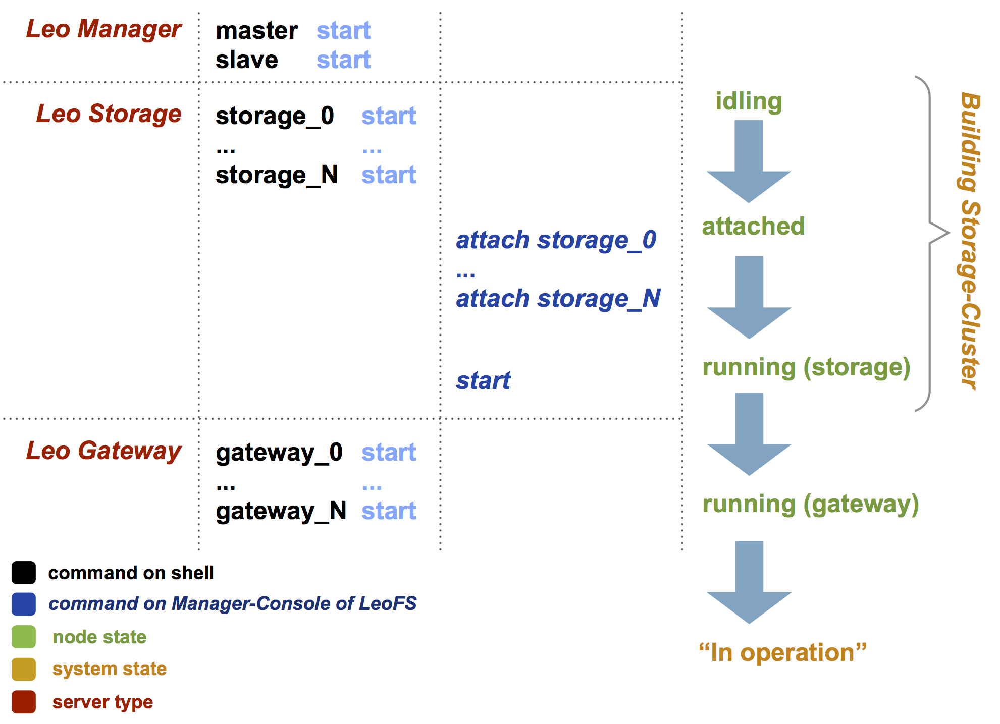
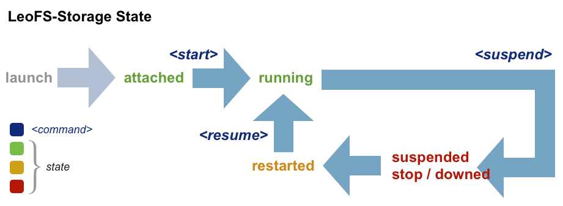

.. LeoFS documentation master file, created by
   sphinx-quickstart on Tue Feb 21 10:38:17 2012.
   You can adapt this file completely to your liking, but it should at least
   contain the root `toctree` directive.

Administration Guide
================================

Order of system launch
----------------------

LeoFS's system launch is very easy and simple as follows.

Operation
^^^^^^^^^

\

+-------------+------------------------------------+------------------------------------------------------------+
| Order       | Command                            | Explanation                                                |
+=============+====================================+============================================================+
| 1           | $ bin/leofs_manager start          | Starting Manager Master **on Manager Master Node**         |
+-------------+------------------------------------+------------------------------------------------------------+
| 2           | $ bin/leofs_manager start          | Starting Manager Slave  **on Manager Slave Node**          |
+-------------+------------------------------------+------------------------------------------------------------+
| 3           | $ bin/leofs_storage start          | Startting Storage(s) **on each Storage Node**              |
+-------------+------------------------------------+------------------------------------------------------------+
| 4           | $ telnet $manager-master 10010     | Accessing **Manager Master Console** by telnet             |
+-------------+------------------------------------+------------------------------------------------------------+
| 5           | > start                            | Starting LeoFS (manager and storages)                      |
+-------------+------------------------------------+------------------------------------------------------------+
| 6           | > status                           | Confirm status of the cluster on Manager Master Console #1 |
+-------------+------------------------------------+------------------------------------------------------------+
| 7           | $ bin/leofs_gateway start          | Startting Gateway(s) **on each Gateway Node**              |
+-------------+------------------------------------+------------------------------------------------------------+
| 8           | > status                           | Confirm status of the cluster on Manager Master Console #2 |
+-------------+------------------------------------+------------------------------------------------------------+

Detail of System launch
-----------------------

.. index::
   pair: Operation; System Launch

Operate starting manager-master on **LeoFS-Manager Master** node
^^^^^^^^^^^^^^^^^^^^^^^^^^^^^^^^^^^^^^^^^^^^^^^^^^^^^^^^^^^^^^^^

::

    $ cd $LEOFS_DEPLOYED_DIR
    $ manager_0/bin/leo_manager start

Operate starting manager-slave on **LeoFS-Manager Slave** node
^^^^^^^^^^^^^^^^^^^^^^^^^^^^^^^^^^^^^^^^^^^^^^^^^^^^^^^^^^^^^^

::

    $ cd $LEOFS_DEPLOYED_DIR
    $ manager_1/bin/leo_manager start

Operate starting storage on each **LeoFS-Storage** node
^^^^^^^^^^^^^^^^^^^^^^^^^^^^^^^^^^^^^^^^^^^^^^^^^^^^^^^

::

    $ cd $LEOFS_DEPLOYED_DIR
    $ storage/bin/leo_storage start

LeoFS Manager Console on **LeoFS-Manager Master** node
^^^^^^^^^^^^^^^^^^^^^^^^^^^^^^^^^^^^^^^^^^^^^^^^^^^^^^

* 'status' command - Inspect LeoFS-cluster ::

    $ telnet 127.0.0.1 10010
    Trying 127.0.0.1...
    Connected to localhost.
    Escape character is '^]'.

    status
    [system config]
                   system version : 0.14.2
                   total replicas : 1
              # of successes of R : 1
              # of successes of W : 1
              # of successes of D : 1
    # of awareness replicas [DC]  : 0
    # of awareness replicas [Rack]: 0
                        ring size : 2^128
                 ring hash (cur)  : -1
                 ring hash (prev) : -1

    [node(s) state]
    -------------------------------------------------------------------------------------------------
     type node                    state       ring (cur)    ring (prev)   when
    -------------------------------------------------------------------------------------------------
     S    storage_0@127.0.0.1     attached                                2012-09-12 14:16:10 +0900
     S    storage_1@127.0.0.1     attached                                2012-09-12 14:17:08 +0900
     S    storage_2@127.0.0.1     attached                                2012-09-12 14:17:23 +0900
     S    storage_3@127.0.0.1     attached                                2012-09-12 14:18:00 +0900

**'start' command** - Launch LeoFS-cluster
^^^^^^^^^^^^^^^^^^^^^^^^^^^^^^^^^^^^^^^^^^

::

    start
    OK

Confirm#1 by **LeoFS-Manager** node's console
^^^^^^^^^^^^^^^^^^^^^^^^^^^^^^^^^^^^^^^^^^^^^

::

    status
    [system config]
                system version : 0.14.2
                total replicas : 1
           # of successes of R : 1
           # of successes of W : 1
           # of successes of D : 1
 # of awareness replicas [DC]  : 0
 # of awareness replicas [Rack]: 0
                     ring size : 2^128
              ring hash (cur)  : 1428891014
              ring hash (prev) : 1428891014

    [node(s) state]
    -------------------------------------------------------------------------------------------------
     type node                    state       ring (cur)    ring (prev)   when
    -------------------------------------------------------------------------------------------------
     S    storage_0@127.0.0.1     running     1428891014    1428891014    2012-09-12 14:16:10 +0900
     S    storage_1@127.0.0.1     running     1428891014    1428891014    2012-09-12 14:17:08 +0900
     S    storage_2@127.0.0.1     running     1428891014    1428891014    2012-09-12 14:17:23 +0900
     S    storage_3@127.0.0.1     running     1428891014    1428891014    2012-09-12 14:18:00 +0900

Launch Gateway on each **LeoFS-Gateway** node
^^^^^^^^^^^^^^^^^^^^^^^^^^^^^^^^^^^^^^^^^^^^^

::

    $ cd $LEOFS_DEPLOYED_DIR/
    $ gateway/bin/leo_gateway start

Confirm#2 by **LeoFS-Manager** master node's console
^^^^^^^^^^^^^^^^^^^^^^^^^^^^^^^^^^^^^^^^^^^^^^^^^^^^

::

    status
    [system config]
                system version : 0.14.2
                total replicas : 1
           # of successes of R : 1
           # of successes of W : 1
           # of successes of D : 1
 # of awareness replicas [DC]  : 0
 # of awareness replicas [Rack]: 0
                     ring size : 2^128
              ring hash (cur)  : 1428891014
              ring hash (prev) : 1428891014

    [node(s) state]
    -------------------------------------------------------------------------------------------------
     type node                    state       ring (cur)    ring (prev)   when
    -------------------------------------------------------------------------------------------------
     S    storage_0@127.0.0.1     running     1428891014    1428891014    2012-09-12 14:16:10 +0900
     S    storage_1@127.0.0.1     running     1428891014    1428891014    2012-09-12 14:17:08 +0900
     S    storage_2@127.0.0.1     running     1428891014    1428891014    2012-09-12 14:17:23 +0900
     S    storage_3@127.0.0.1     running     1428891014    1428891014    2012-09-12 14:18:00 +0900
     G    gateway_0@127.0.0.1     running     1428891014    1428891014    2012-09-12 14:23:26 +0900

\

Storage-cluster Operation Commands
----------------------------------

.. index::
   pair: Operation; Command

LeoFS-cluster's operation commands are executed on **LeoFS-Manager Console**.

.. index::
   Storage-cluster-related-commands

Table of Storage-cluster's Commands
^^^^^^^^^^^^^^^^^^^^^^^^^^^^^^^^^^^

\

+--------------------------------+---------------------------------------------------------------------------------------------------+
| Command                        | Explanation                                                                                       |
+================================+===================================================================================================+
| **Storage-node related commands:**                                                                                                 |
+--------------------------------+---------------------------------------------------------------------------------------------------+
| detach `${storage-node}`       | * Remove a storage-node from the LeoFS storage-cluster                                            |
|                                | * Current status: ``running`` | ``stop``                                                          |
+--------------------------------+---------------------------------------------------------------------------------------------------+
| suspend `${storage-node}`      | * Suspend a storage-node for maintenance, Also this command does NOT change "routing-table (RING)"|
|                                | * Current status: ``running``                                                                     |
+--------------------------------+---------------------------------------------------------------------------------------------------+
| resume `${storage-node}`       | * Resume a storage-node                                                                           |
|                                | * Current status: ``suspended`` | ``restarted``                                                   |
+--------------------------------+---------------------------------------------------------------------------------------------------+
| **Storage-cluster related commands:**                                                                                              |
+--------------------------------+---------------------------------------------------------------------------------------------------+
| start                          | * Launch LeoFS after distributed "routing-table (RING)" from Manager to Storage and Gateway       |
+--------------------------------+---------------------------------------------------------------------------------------------------+
| rebalance                      | * Move or Copy files into the LeoFS storage-cluster due to changed RING                           |
+--------------------------------+---------------------------------------------------------------------------------------------------+
| whereis `${file-path}`         | * Retrieve status of an assigned file                                                             |
+--------------------------------+---------------------------------------------------------------------------------------------------+
| **Recover**                                                                                                                        |
+--------------------------------+---------------------------------------------------------------------------------------------------+
| recover file `${file-path}`    | * Synchronize an object between nodes in charge                                                   |
+--------------------------------+---------------------------------------------------------------------------------------------------+
| recover node `${storage-node}` | * Recover belonging targe-node's objects                                                          |
+--------------------------------+---------------------------------------------------------------------------------------------------+
| recover ring `${storage-node}` | * Synchronize target-node's RING with Manager's RING                                              |
+--------------------------------+---------------------------------------------------------------------------------------------------+

.. index::
   detach-command

**'detach'** - Storage node is removed from the LeoFS-Cluster
^^^^^^^^^^^^^^^^^^^^^^^^^^^^^^^^^^^^^^^^^^^^^^^^^^^^^^^^^^^^^

Command: ``detach ${storage-node}``

::

    detach storage_0@127.0.0.1
    OK
    rebalance
    OK

.. index::
   suspend-command

**'suspend'** - Suspend a storage node
^^^^^^^^^^^^^^^^^^^^^^^^^^^^^^^^^^^^^^

Command: ``suspend ${storage-node}``

::

    suspend storage_0@127.0.0.1
    OK

.. index::
   resume-command

**'resume'** - Resume a storage node
^^^^^^^^^^^^^^^^^^^^^^^^^^^^^^^^^^^^

Command: ``resume ${storage-node}``

::

    resume storage_0@127.0.0.1
    OK

.. index::
   rebalance-command

**'rebalance'** - Rebalance files into the cluster
^^^^^^^^^^^^^^^^^^^^^^^^^^^^^^^^^^^^^^^^^^^^^^^^^^

Command: ``rebalance``

::

    rebalance
    OK

.. _whereis:

.. index::
   whereis-command

**'whereis'**
^^^^^^^^^^^^^

Paths used by `whereis` are ruled by :ref:`this rule <s3-path-label>`

Command: ``whereis ${file-path}``

::

    whereis leo/fast/storage.key
    -----------------------------------------------------------------------------------------------------------------------
     del? node                 ring address    size   # of chunks  checksum    vclock            when
    -----------------------------------------------------------------------------------------------------------------------
          storage_1@127.0.0.1  207643840133    35409  0             4116193149  1332407492290951  2012-06-29 14:23:31 +0900
          storage_0@127.0.0.1  207643840133    35409  0             4116193149  1332407492290951  2012-06-29 14:23:31 +0900

\

\

**recover** - Recover an object, belonging targe-node's objects and RING
^^^^^^^^^^^^^^^^^^^^^^^^^^^^^^^^^^^^^^^^^^^^^^^^^^^^^^^^^^^^^^^^^^^^^^^^

.. index:: recover-file-command

**'recover file'** - Synchronize an object between nodes in charge

::

  recover file leo/fast/storage.key
  OK

\

.. index:: recover-node-command

**'recover node'** - Recover belonging targe-node's objects

::

  recover node storage_0@127.0.0.1
  OK

\

.. index:: recover-ring-command

**'recover ring'** - Synchronize target-node's RING with Manager's RING

::

  recover ring storage_0@127.0.0.1
  OK

\
\

Storage Maintenance Commands
----------------------------

\

+-----------------------------------------------------------+----------------------------------------------------------------+
| Command                                                   | Explanation                                                    |
+===========================================================+================================================================+
| **Disk Usage**                                                                                                             |
+-----------------------------------------------------------+----------------------------------------------------------------+
| du `${storage-node}`                                      | * Display disk usages(like xnix du command)                    |
+-----------------------------------------------------------+----------------------------------------------------------------+
| du detail `${storage-node}`                               | * Display disk usages in detail (like xnix du command)         |
+-----------------------------------------------------------+----------------------------------------------------------------+
| **Compaction**                                                                                                             |
+-----------------------------------------------------------+----------------------------------------------------------------+
| compact start `${storage-node}` `all | ${num_of_targets}` | * Compact raw files used by the LeoFS Storage subsystem        |
| `[${num_of_compact_proc}]`                                | * Default ${num_of_compact_proc} is '3'                        |
+-----------------------------------------------------------+----------------------------------------------------------------+
| compact suspend `${storage-node}`                         | * Suspend a compaction job in progress                         |
+-----------------------------------------------------------+----------------------------------------------------------------+
| compact resume  `${storage-node}`                         | * Resume a compaction job under suspension                     |
+-----------------------------------------------------------+----------------------------------------------------------------+
| compact status  `${storage-node}`                         | * Display compation statuses                                   |
|                                                           | * Compaction's status: ``idle``, ``running``, ``suspend``      |
+-----------------------------------------------------------+----------------------------------------------------------------+

\

**du** - Disk Usage
^^^^^^^^^^^^^^^^^^^

.. index:: du-command

**'du'** - Display disk usage(summary)

Command: ``du ${storage-node}``

::

    du storage_0@127.0.0.1
     active number of objects: 19968
      total number of objects: 39936
       active size of objects: 198256974.0
        total size of objects: 254725020.0
         ratio of active size: 77.83%
        last compaction start: 2013-03-04 12:39:47 +0900
          last compaction end: 2013-03-04 12:39:55 +0900

.. index:: du-detail-command

**'du detail'** - Display disk usage in detail(per raw file)

Command: ``du detail ${storage-node}``

::

    du detail storage_0@127.0.0.1
    [du(storage stats)]
                    file path: /home/leofs/dev/leofs/package/leofs/storage/avs/object/0.avs
     active number of objects: 320
      total number of objects: 640
       active size of objects: 3206378.0
        total size of objects: 4082036.0
         ratio of active size: 78.55%
        last compaction start: 2013-03-04 12:39:47 +0900
          last compaction end: 2013-03-04 12:39:55 +0900
    .
    .
    .
                    file path: /home/leofs/dev/leofs/package/leofs/storage/avs/object/63.avs
     active number of objects: 293
      total number of objects: 586
       active size of objects: 2968909.0
        total size of objects: 3737690.0
         ratio of active size: 79.43%
        last compaction start: ____-__-__ __:__:__
          last compaction end: ____-__-__ __:__:__

\

**compact** - Remove logical deleted objects and metadata
^^^^^^^^^^^^^^^^^^^^^^^^^^^^^^^^^^^^^^^^^^^^^^^^^^^^^^^^^

\

.. image:: _static/images/leofs-compaction-state-transition.png
   :width: 640px

\
\

.. index:: compact-start-command

**'compact start'** - Start doing compaction raw-files with targets and a number of compaction-processes

Command: ``compact start ${storage-node} all | ${num_of_targets} [${num_of_compact_proc}]``

.. note:: Default ``${num_of_compact_proc}`` is '3' - You can control the number of process to execute compaction in parallel. It enables you to get maximum performance by setting a appropriate number corresponding with number of cores.

::

    ## All compaction-targets will be executed with 3 concurrent processes
    ## (default concurrents is 3)
    compact start storage_0@127.0.0.1 all
    OK

::

    ## Number of compaction-targets will be executed with 2 concurrent processes
    compact start storage_0@127.0.0.1 5 2
    OK

\

.. index:: compact-suspend-command

**'compact suspend'** - Suspend a compaction job in progress

Command: ``compact suspend ${storage-node}``

::

    compact suspend storage_0@127.0.0.1
    OK

\

.. index:: compact-resume-command

**'compact resume'** - Resume a compaction job under suspension

Command: ``compact resume ${storage-node}``

::

    compact resume storage_0@127.0.0.1
    OK

\

.. index:: compact-status-command

**'compact status'** - Retrieve compation statuses

Command: ``compact status ${storage-node}``

* Compaction's status: ``idle``, ``running``, ``suspend``

::

  compact status storage_0@127.0.0.1
          current status: running
   last compaction start: 2013-03-04 12:39:47 +0900
           total targets: 64
    # of pending targets: 5
    # of ongoing targets: 3
    # of out of targets : 56

Gateway Maintenance Commands
----------------------------

\

+------------------------------------------------------+-----------------------------------------------------------------------------------+
| Command                                              | Explanation                                                                       |
+======================================================+===================================================================================+
| purge ${file-path}                                   | * Purge a cached file if the specified file existed in cache                      |
+------------------------------------------------------+-----------------------------------------------------------------------------------+
| remove ${gateway-node}                               | * Able to remove gateway-node from manager when state of specified node is 'stop' |
+------------------------------------------------------+-----------------------------------------------------------------------------------+

.. _purge:

.. index::
   purge-command

**'purge'**
^^^^^^^^^^^

Paths used by `purge` are ruled by :ref:`this rule <s3-path-label>`

Command: ``purge ${file-path}``

::

    purge leofs.org/is/s3/comaptible/storage.key
    OK

\
\

Manager Maintenance Commands
----------------------------

+------------------------------------------------------+----------------------------------------------------------------+
| Command                                              | Explanation                                                    |
+======================================================+================================================================+
| update-managers ${manager-master} ${manager-slave}   | * Update manager's nodes to specified master/slave nodes       |
+------------------------------------------------------+----------------------------------------------------------------+
| backup-mnesia ${backup-filepath}                     | * Backup mnesia-data to specified filepath                     |
+------------------------------------------------------+----------------------------------------------------------------+
| restore-mnesia ${backup-filepath}                    | * Restore mnesia-data from specified filepath                  |
+------------------------------------------------------+----------------------------------------------------------------+

S3-API Commands
---------------

\

+------------------------------------------------------+-------------------------------------------------------------------+
| Command                                              | Explanation                                                       |
+======================================================+===================================================================+
| create-user `${user-id}`                             | * Generate a S3 key pair(AccessKeyID and SecretAccessKey)         |
+------------------------------------------------------+-------------------------------------------------------------------+
| delete-user `${user-id}`                             | * Remove a user                                                   |
+------------------------------------------------------+-------------------------------------------------------------------+
| get-users                                            | * Retrieve all of registered users                                |
+------------------------------------------------------+-------------------------------------------------------------------+
| set-endpoint `${endpoint}`                           | * Register a new S3 Endpoint                                      |
|                                                      | * LeoFS's domains are ruled by :ref:`this rule <s3-path-label>`   |
+------------------------------------------------------+-------------------------------------------------------------------+
| delete-endpoint `${endpoint}`                        | * Delete a S3 Endpoint                                            |
+------------------------------------------------------+-------------------------------------------------------------------+
| get-endpoints                                        | * Retrieve all of S3 Endpoints registered                         |
+------------------------------------------------------+-------------------------------------------------------------------+
| add-bucket `${bucket}` `${access_key_id}`            | * Create a bucket from Manager(s) and Gateway(s)                  |
+------------------------------------------------------+-------------------------------------------------------------------+
| delete-bucket `${bucket}` `${access_key_id}`         | * Remove a bucket from Manager(s), Gateway(s) and Storage-cluster |
+------------------------------------------------------+-------------------------------------------------------------------+
| get-buckets                                          | * Retrieve all of registered buckets                              |
+------------------------------------------------------+-------------------------------------------------------------------+

.. ### CREATE USER ###

.. _s3-create-user:

.. index::
   create-user-command

**'create-user'** - Create a user and generate a S3 key pair(AccessKeyID and SecretAccessKey)
^^^^^^^^^^^^^^^^^^^^^^^^^^^^^^^^^^^^^^^^^^^^^^^^^^^^^^^^^^^^^^^^^^^^^^^^^^^^^^^^^^^^^^^^^^^^^

Command: ``create-user ${user-id}``

::

   create-user test_account
   access-key-id: be8111173c8218aaf1c3
   secret-access-key: 929b09f9b794832142c59218f2907cd1c35ac163

.. ### DELETE USER ###

.. _s3-delete-user:

.. index::
   delete-user-command

**'delete-user'** - Remove a user from LeoFS manager's db
^^^^^^^^^^^^^^^^^^^^^^^^^^^^^^^^^^^^^^^^^^^^^^^^^^^^^^^^^

Command: ``delete-user ${user-id}``

::

   delete-user test
   ok

.. ### GET USERS ###

.. _s3-get-users:

.. index::
   get-users-command

**'get-users'** - Retrieve users from LeoFS manager's db
^^^^^^^^^^^^^^^^^^^^^^^^^^^^^^^^^^^^^^^^^^^^^^^^^^^^^^^^

Command: ``get-users``

::

   get-users
   user_id     | access_key_id          | created_at
   ------------+------------------------+---------------------------
   _test_leofs | 05236                  | 2012-12-07 10:27:39 +0900
   leo         | 39bbad4f3b837ed209fb   | 2012-12-07 10:27:39 +0900

.. ### SET ENDPOINT ###

.. _s3-set-endpoint:

.. index::
   set-endpoint-command

**'set-endpoint'** - Register a new Endpoint
^^^^^^^^^^^^^^^^^^^^^^^^^^^^^^^^^^^^^^^^^^^^

.. note:: LeoFS's domains are ruled by :ref:`this rule <s3-path-label>`

Command: ``set-endpoint ${endpoint}``

::

   set-endpoint test_account
   OK

.. ### DELETE ENDPOINTS ###

.. _s3-delete-endpoint:

.. index::
   delete-endpoint-command

**'delete-endpoint'** - Remove an Endpoint
^^^^^^^^^^^^^^^^^^^^^^^^^^^^^^^^^^^^^^^^^^

Command: ``delete-endpoint ${endpoint}``

::

   delete-endpoint test
   OK

.. ### GET ENDPOINTS ###

.. _s3-get-endpoints:

.. index::
   get-endpoints-command

**'get-endpoints'** - Retrieve all of Endpoints registered
^^^^^^^^^^^^^^^^^^^^^^^^^^^^^^^^^^^^^^^^^^^^^^^^^^^^^^^^^^

Command: ``get-endpoints``

::

    get-endpoints
    endpoint         | created at
    -----------------+---------------------------
    s3.amazonaws.com | 2012-09-12 14:09:52 +0900
    localhost        | 2012-09-12 14:09:52 +0900
    leofs.org        | 2012-09-12 14:09:52 +0900

.. ### ADD BUCKET ###
.. _s3-add-bucket:

.. index::
    add-bucket-command

**'add-bucket'** - Create a bucket from Manager(s) and Gateway(s)
^^^^^^^^^^^^^^^^^^^^^^^^^^^^^^^^^^^^^^^^^^^^^^^^^^^^^^^^^^^^^^^^^

Command: ``add-bucket ${bucket} ${access_key_id}``

::

    add-bucket backup 05236
    OK

.. ### DELETE BUCKET ###
.. _s3-delete-bucket:

.. index::
    delete-bucket-command

**'delete-bucket'** - Remove a bucket from Manager(s), Gateway(s) and Storage-cluster
^^^^^^^^^^^^^^^^^^^^^^^^^^^^^^^^^^^^^^^^^^^^^^^^^^^^^^^^^^^^^^^^^^^^^^^^^^^^^^^^^^^^^

Command: ``delete-bucket ${bucket} ${access_key_id}``

::

    delete-bucket backup 05236
    OK

.. ### GET BUCKETS ###
.. _s3-get-buckets:

.. index::
   get-buckets-command

**'get-buckets'** - Retrieve list of Buckets registered
^^^^^^^^^^^^^^^^^^^^^^^^^^^^^^^^^^^^^^^^^^^^^^^^^^^^^^^

Command: ``get-buckets``

::

    get-buckets
    bucket | owner     | created at
    -------+-----------+---------------------------
    backup | __leofs__ | 2012-09-12 14:30:07 +0900
    docs   | __leofs__ | 2012-09-12 14:29:30 +0900
    logs   | __leofs__ | 2012-09-12 14:29:34 +0900
    photo  | __leofs__ | 2012-09-12 14:29:26 +0900

\
\

Miscellaneous Commands
----------------------

\

+------------------------------------------------------+----------------------------------------------------------------+
| Command                                              | Explanation                                                    |
+======================================================+================================================================+
| status [${NODE}]                                     | * Retrieve status of the cluster                               |
|                                                      | * Retrieve status of the node                                  |
+------------------------------------------------------+----------------------------------------------------------------+
| history                                              | Retrieve operation histories                                   |
+------------------------------------------------------+----------------------------------------------------------------+

.. index::
   status-command

**'status'** - Retrieve status of the cluster
^^^^^^^^^^^^^^^^^^^^^^^^^^^^^^^^^^^^^^^^^^^^^

Command-1: ``status``

::

    status
    [system config]
                 version : 0.12.7
     # of replicas       : 1
     # of successes of R : 1
     # of successes of W : 1
     # of successes of D : 1
               ring size : 2^128
        ring hash (cur)  : 1428891014
        ring hash (prev) : 1428891014

    [node(s) state]
    -------------------------------------------------------------------------------------------------
     type node                    state       ring (cur)    ring (prev)   when
    -------------------------------------------------------------------------------------------------
     S    storage_0@127.0.0.1     running     1428891014    1428891014    2012-09-12 14:16:10 +0900
     S    storage_1@127.0.0.1     running     1428891014    1428891014    2012-09-12 14:17:08 +0900
     S    storage_2@127.0.0.1     running     1428891014    1428891014    2012-09-12 14:17:23 +0900
     S    storage_3@127.0.0.1     running     1428891014    1428891014    2012-09-12 14:18:00 +0900
     G    gateway_0@127.0.0.1     running     1428891014    1428891014    2012-09-12 14:23:26 +0900

Command-2: ``status ${storage-node}`` OR ``status ${gateway-node}``

::

    status storage_0@127.0.0.1
    [config]
                version : 0.14.1
          obj-container : [[{path,"./avs"},{num_of_containers,64}]]
                log dir : ./log
    [status-1: ring]
      ring state (cur)  : 64212f2d
      ring state (prev) : 64212f2d
    [status-2: erlang-vm]
             vm version : 5.9.3.1
        total mem usage : 30886632
       system mem usage : 12774309
        procs mem usage : 18178027
          ets mem usage : 1154464
                  procs : 326/1048576
            kernel_poll : true
       thread_pool_size : 32
    [status-3: # of msgs]
       replication msgs : 0
        vnode-sync msgs : 0
         rebalance msgs : 0

::

    status gateway_0@127.0.0.1
    [config-1]
                          version : 0.14.1
                          log dir : ./log
    [config-2]
      -- http-server-related --
              using api [s3|rest] : s3
                   listening port : 8080
               listening ssl port : 8443
                   # of_acceptors : 0
      -- cache-related --
          http cache [true|false] : false
               # of cache_workers : 128
                     cache expire : 300
            cache max content len : 1048576
               ram cache capacity : 1073741824
           disc cache capacity    : 0
           disc cache threshold   : 1048576
           disc cache data dir    : ./cache/data
           disc cache journal dir : ./cache/journal
      -- large-object-related --
            max # of chunked objs : 1000
                max object length : 524288000
            chunked object length : 5242880
     threshold chunked obj length : 5767168

     [status-1: ring]
                ring state (cur)  : 64212f2d
                ring state (prev) : 64212f2d

    [status-2: erlang-vm]
                       vm version : 5.9.3.1
                  total mem usage : 48095776
                 system mem usage : 34839664
                  procs mem usage : 13261128
                    ets mem usage : 1195144
                            procs : 504/1048576
                      kernel_poll : true
                 thread_pool_size : 32

.. index::
   history-command

**'history'** - Retrieve operation histories
^^^^^^^^^^^^^^^^^^^^^^^^^^^^^^^^^^^^^^^^^^^^

Command: ``history``

::

    history
    [Histories]
    1    | 2012-06-29 14:23:01 +0900 | status
    2    | 2012-06-29 14:23:02 +0900 | status
    3    | 2012-06-29 14:23:03 +0900 | attach storage_0@127.0.0.1
    4    | 2012-06-29 14:23:04 +0900 | attach storage_1@127.0.0.1
    5    | 2012-06-29 14:23:05 +0900 | attach storage_2@127.0.0.1
    6    | 2012-06-29 14:23:06 +0900 | attach storage_3@127.0.0.1
    7    | 2012-06-29 14:23:07 +0900 | start
    8    | 2012-06-29 14:23:15 +0900 | status

.. index::
   attach-new-storage

\
\
\
\

Attach/Detach node into the Storage-cluster during in operation
---------------------------------------------------------------

\

.. image:: _static/images/leofs-order-of-attach.png
   :width: 640px

.. index::
   detach-storage

.. image:: _static/images/leofs-order-of-detach.png
   :width: 640px

