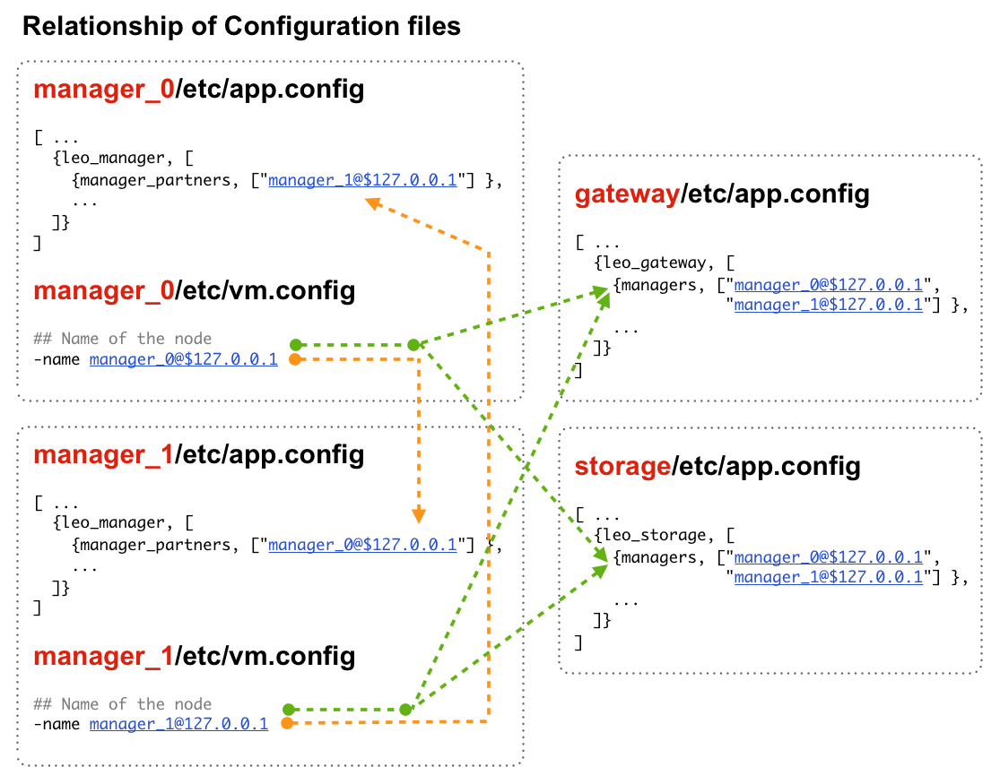
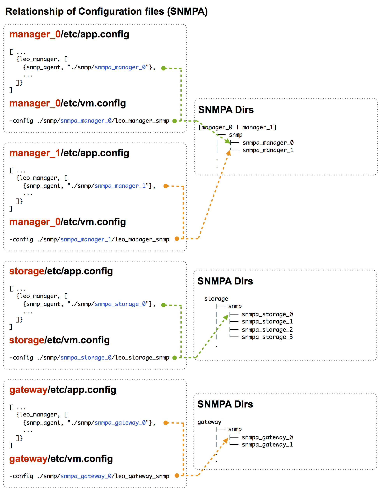

.. LeoFS documentation

Configuration of LeoFS
================================

.. index::
   pair: Configuration; Relationship of configuration files

Relationship of configuration files
-----------------------------------

.. index::
   pair: Configuration; LeoFS Manager-Master

LeoFS Manager-Master
--------------------

**Manager-Master's Properties for launch**

* **File-1: ${LEOFS_DEPLOYED_DIR}/package/leofs/manager_0/etc/app.config**

+----------------+--------------------------------------------------------+
|Property        | Configuration                                          |
+================+========================================================+
|${SLAVE-IP}     | Manager-Slave node's IP-address                        |
+----------------+--------------------------------------------------------+
|${SNMPA-DIR}    | SNMPA configuration files directory                    |
|                |                                                        |
|                | - ref:${LEOFS_SRC}/apps/leo_manager/snmp/              |
|                |                                                        |
|                | - [snmpa_manager_0|snmpa_manager_1|snmpa_manager_0]    |
+----------------+--------------------------------------------------------+

.. code-block:: erlang

    [
        {sasl, [
                {sasl_error_logger, {file, "./log/sasl-error.log"}},
                {errlog_type, error},
                {error_logger_mf_dir, "./log/sasl"},
                {error_logger_mf_maxbytes, 10485760}, % 10 MB max file size
                {error_logger_mf_maxfiles, 5}         % 5 files max
               ]},
        {mnesia, [
                  {dir, "./work/mnesia/${IP}"},
                  {dump_log_write_threshold, 50000},
                  {dc_dump_limit,            40}
                 ]},
        {leo_manager, [
                   %% == System Ver ==
                   {system_version, "0.14.0-RC1" },

                   %% == System Configuration ==
                   %%
                   %% n: # of replicated files
                   %% w: # of successes of write-operation
                   %% r: # of successes of read-operation
                   %% d: # of successes of delete-operation
                   %% bit_of_ring: Ring size - 128 = 2^128
                   {system, [{n, 1 },
                             {w, 1 },
                             {r, 1 },
                             {d, 1 },
                             {bit_of_ring, 128}
                            ]},

                   %% == Available Commands ==
                   {available_commands, all },

                   %% == Manager Properties ==
                   %% Mode of server - [master|slave]
                   {manager_mode,     master },
                   %% Partner of manager's alias
                   {manager_partners, ["manager_1@127.0.0.1"] },
                   %% Manager accepatable port number
                   {port_cui,         10010 },
                   {port_json,        10020 },

                   %% # of acceptors
                   {num_of_acceptors_cui,   3},
                   {num_of_acceptors_json, 16},

                   %% Compaction: # of execution of conncurrent
                   {num_of_compact_proc, 3 },

                   %% == Log-specific properties ==
                   %%
                   %% Log output level
                   %%   0: debug
                   %%   1: info
                   %%   2: warning
                   %%   3: error
                   {log_level,    1 },
                   %% Log appender - [file]
                   {log_appender, [
                                   {file, [{path, "./log/app"}]}
                                  ]},

                   %% == Directories ==
                   %%
                   %% Directory of log output
                   {log_dir,          "./log"},
                   %% Directory of mq's db-file
                   {queue_dir,        "./work/queue"},
                   %% Directory of snmp-agent
                   {snmp_agent,       "./snmp/snmpa_manager_0/LEO-MANAGER"}
                  ]},
    ].

* **File-2: ${LEOFS_DEPLOYED_DIR}/package/leofs/manager_0/etc/vm.args**

+----------------+--------------------------------------------------------+
|Property        | Configuration                                          |
+================+========================================================+
|${MASTER-IP  }  | Manager-Master IP                                      |
+----------------+--------------------------------------------------------+
|${SNMPA-DIR}    | SNMPA configuration files directory                    |
+----------------+--------------------------------------------------------+

.. code-block:: bash

    ## Name of the node
    -name manager_0@${MASTER-IP}

    ## Cookie for distributed erlang
    -setcookie 401321b4

    ## Heartbeat management; auto-restarts VM if it dies or becomes unresponsive
    ## (Disabled by default..use with caution!)
    ##-heart

    ## Enable kernel poll and a few async threads
    +K true
    +A 32

    ## Increase number of concurrent ports/sockets
    ##-env ERL_MAX_PORTS 4096

    ## Tweak GC to run more often
    ##-env ERL_FULLSWEEP_AFTER 10

    ## SNMP Config file
    -config ./snmp/${SNMPA-DIR}/leo_manager_snmp

    ## set up the node with the -hidden flag
    -hidden

.. index::
   pair: Configuration; LeoFS Manager-Slave

LeoFS Manager-Slave
-------------------

Manager-Slave's Properties for launch

* **File-1: ${LEOFS_DEPLOYED_DIR}/package/leofs/manager_0/etc/app.config**

+----------------+--------------------------------------------------------+
|Property        | Configuration                                          |
+================+========================================================+
|${MASTER-IP}    | Manager-Master node's IP-address                       |
+----------------+--------------------------------------------------------+
|${SNMPA-DIR}    | SNMPA configuration files directory                    |
+----------------+--------------------------------------------------------+

.. code-block:: erlang

    [

        {leo_manager,
                 [

                  %% Manager Configuration
                  {manager_mode,     slave },
                  {manager_partners, ["manager_0@${MASTER-IP}"] },
                  {port,             10011 },
                  {num_of_acceptors, 3},

                  %% Directories
                  {log_dir,          "./log"},
                  {queue_dir,        "./work/queue"},
                  {snmp_agent,       "./snmp/${SNMPA-DIR}/LEO-MANAGER"}
                 ]}
    ].

* **File-2: ${LEOFS_DEPLOYED_DIR}/package/leofs/manager_1/etc/vm.args**

+----------------+--------------------------------------------------------+
|Property        | Configuration                                          |
+================+========================================================+
|${SLAVE-IP}     | Manager-Slave IP                                       |
+----------------+--------------------------------------------------------+
|${SNMPA-DIR}    | SNMPA configuration files directory                    |
+----------------+--------------------------------------------------------+

.. code-block:: bash

    ## Name of the node
    -name manager_0@${SLAVE-IP}

    ## Cookie for distributed erlang
    -setcookie 401321b4

    ## Heartbeat management; auto-restarts VM if it dies or becomes unresponsive
    ## (Disabled by default..use with caution!)
    ##-heart

    ## Enable kernel poll and a few async threads
    +K true
    +A 32

    ## Increase number of concurrent ports/sockets
    ##-env ERL_MAX_PORTS 4096

    ## Tweak GC to run more often
    ##-env ERL_FULLSWEEP_AFTER 10

    ## SNMP Config file
    -config ./snmp/${SNMPA-DIR}/leo_manager_snmp

    ## set up the node with the -hidden flag
    -hidden

.. index::
   pair: Configuration; LeoFS Storage

LeoFS Storage
-------------

Storage's Properties for launch

* **File-1: ${LEOFS_DEPLOYED_DIR}/package/leofs/storage/etc/app.config**

+-------------------------+--------------------------------------------------------+
|Property                 | Configuration                                          |
+=========================+========================================================+
|${OBJECT_STORAGE_DIR}    | Object Storage directory  - Default:"./avs"            |
+-------------------------+--------------------------------------------------------+
|${MANAGER_MASTER_IP}     | Manager-master node's IP-address                       |
+-------------------------+--------------------------------------------------------+
|${MANAGER_SLAVE_IP}      | Manager-slave node's IP-address                        |
+-------------------------+--------------------------------------------------------+
|${SNMPA-DIR}             | SNMPA configuration files directory                    |
|                         |                                                        |
|                         | - ref:${LEOFS_SRC}/apps/leo_storage/snmp/              |
|                         |                                                        |
|                         | - [snmpa_storage_0|snmpa_storage_1|snmpa_storage_0]    |
+-------------------------+--------------------------------------------------------+

.. code-block:: erlang

    {leo_storage, [
                   %% == System Ver ==
                   {system_version, "0.14.0-RC1" },

                   %% == Storage Configuration ==
                   %%
                   %% Object containers properties:
                   %% @param path              - Directory of object-containers
                   %% @param num_of_containers - # of object-containers
                   %%
                   %% Notes:
                   %%   If you set up LeoFS on 'development', default value - "./avs" - is OK.
                   %%   If you set up LeoFS on 'production' or 'staging', You should need to change "volume",
                   %%       And We recommend volume's partition is XFS.
                   %%
                   {obj_containers,     [[{path, ${OBJECT_STORAGE_DIR}}, {num_of_containers, 64}]] },

                   %% leo-manager's nodes
                   {managers,           [${MANAGER_MASTER_IP}, ${MANAGER_SLAVE_IP}] },

                   %% # of virtual-nodes
                   {num_of_vnodes,      168 },

                   %% # of mq-server's processes
                   {num_of_mq_procs,    8 },

                   %% == For Ordning-Reda ==
                   %% Size of stacked objects (bytes)
                   {size_of_stacked_objs,    67108864 },
                   %% Stacking timeout (msec)
                   {stacking_timeout,        5000 },

                   %% == Log-specific properties ==
                   %%
                   {log_level,    1 },
                   {log_appender, [
                                   {file, [{path, "./log/app"}]}
                                  ]},

                   %% == Directories ==
                   %%
                   %% Directory of log output
                   {log_dir,     "./log"},
                   %% Directory of mq's db-files
                   {queue_dir,   "./work/queue"},
                   %% Directory of SNMP-Agent
                   {snmp_agent,  ${SNMPA-DIR}}
                  ]},

* **File-2: ${LEOFS_DEPLOYED_DIR}/package/leofs/storage/etc/vm.args**

+-------------------------+--------------------------------------------------------+
|Property                 | Configuration                                          |
+=========================+========================================================+
|${STORAGE_ALIAS}         | Storage node's Alias name                              |
+-------------------------+--------------------------------------------------------+
|${STORAGE_IP}            | Storage node's IP-Address                              |
+-------------------------+--------------------------------------------------------+
|${SNMPA-DIR}             | SNMPA configuration files directory                    |
+-------------------------+--------------------------------------------------------+

.. code-block:: bash

    ## Name of the node
    -name ${STORAGE_ALIAS}@${STORAGE_IP}

    ## Cookie for distributed erlang
    -setcookie 401321b4

    ## Heartbeat management; auto-restarts VM if it dies or becomes unresponsive
    ## (Disabled by default..use with caution!)
    ##-heart

    ## Enable kernel poll and a few async threads
    +K true
    +A 32

    ## Increase number of concurrent ports/sockets
    ##-env ERL_MAX_PORTS 4096

    ## Tweak GC to run more often
    ##-env ERL_FULLSWEEP_AFTER 10

    ## SNMP Config file
    -config ./snmp/${SNMPA-DIR}/leo_storage_snmp

    ## Sets the maximum number of concurrent processes for this system
    +P 1048576

    ## set up the node with the -hidden flag
    -hidden

.. index::
   pair: Configuration; LeoFS Gateway

LeoFS Gateway
-------------

Gateway's Properties for launch

* **File-1: ${LEOFS_DEPLOYED_DIR}/package/leofs/gateway/etc/app.config**

+---------------------------+----------------------------------------------------------------------------------+
|Property                   | Configuration                                                                    |
+===========================+==================================================================================+
|${LISTENING_PORT}          | Gateway's listening port number                                                  |
+---------------------------+----------------------------------------------------------------------------------+
|${NUM_OF_LISTENNER}        | Numbers of Gateway's listening processes                                         |
+---------------------------+----------------------------------------------------------------------------------+
|${MANAGER_MASTER_IP}       | Manager-master node's IP-address                                                 |
+---------------------------+----------------------------------------------------------------------------------+
|${MANAGER_SLAVE_IP}        | Manager-slave node's IP-address                                                  |
+---------------------------+----------------------------------------------------------------------------------+
|${SNMPA-DIR}               | SNMPA configuration files directory                                              |
|                           |                                                                                  |
|                           | - ref:${LEOFS_SRC}/apps/leo_gateway/snmp/                                        |
|                           |                                                                                  |
|                           | - [snmpa_gateway_0|snmpa_gateway_1|snmpa_gateway_0]                              |
+---------------------------+----------------------------------------------------------------------------------+
|${USE_S3_AUTH}             | Whether using S3 Authentication or not.                                          |
|                           | *Default value is 'true'*                                                        |
+---------------------------+----------------------------------------------------------------------------------+
| *Cache related items*                                                                                        |
+---------------------------+----------------------------------------------------------------------------------+
|${IS_HTTP_CACHE}           | Method of chache - **http** OR **inner** *(default)*                             |
|                           |                                                                                  |
|                           | +-----+---------------------------------------------------------------------+    |
|                           | |true |HTTP-base cache server - Like a *Varnish* OR *Squid*                 |    |
|                           | +-----+---------------------------------------------------------------------+    |
|                           | |false|Stored objects into the gateway's memory. When READ, the *Etag* of   |    |
|                           | |     |a cache is comapared with backend-storage's *Etag*.                  |    |
|                           | |     | +----------+--------------------------------------------+           |    |
|                           | |     | |matched   | Return a cache                             |           |    |
|                           | |     | +----------+--------------------------------------------+           |    |
|                           | |     | |unmatched | Return an original-object from the storage |           |    |
|                           | |     | +----------+--------------------------------------------+           |    |
|                           | +-----+---------------------------------------------------------------------+    |
+---------------------------+----------------------------------------------------------------------------------+
|${CACHE_RAM_CAPACITY}      | Memory-cache capacity in byte                                                    |
|                           | (ex. 4000000000 means using 4GB memory cache)                                    |
+---------------------------+----------------------------------------------------------------------------------+
|${CACHE_DISC_CAPACITY}     | Disc-cache capacity Size in byte - default: 0Byte (disabled)                     |
+---------------------------+----------------------------------------------------------------------------------+
|${CACHE_DISC_THRESHOLD_LEN}| When a length of object exceed this value, the object is stored into the disc    |
+---------------------------+----------------------------------------------------------------------------------+
|${CACHE_DISC_DIR_DATA}     | Disc-cache's directory for data - storing desctination is SSD (or HDD)           |
+---------------------------+----------------------------------------------------------------------------------+
|${CACHE_DISC_DIR_JOURNAL}  | Disc-cache's directory for journal                                               |
+---------------------------+----------------------------------------------------------------------------------+
|${CACHE_EXPIRE}            | [**cache-mode:http**] Http Cache Expire in second                                |
+---------------------------+----------------------------------------------------------------------------------+
|${CACHE_MAX_C_LEN}         | [**cache-mode:http**] Http Cache Max Content Length in byte                      |
|                           |                                                                                  |
|                           | Note: *LeoFS-gateway can cache up to 1MB*                                        |
+---------------------------+----------------------------------------------------------------------------------+
|${CACHE_C_TYPE}            | [**cache-mode:http**] Http Cache Content Type                                    |
|                           |                                                                                  |
|                           | ex-1) ["image/png", "image/jpeg"]                                                |
|                           |                                                                                  |
|                           |       Caching only if its Content-Type was *"image/png"* OR *"image/jpeg"*       |
|                           |                                                                                  |
|                           | ex-2) []                                                                         |
|                           |                                                                                  |
|                           |       When rule is empty, all objects are cached.                                |
+---------------------------+----------------------------------------------------------------------------------+
|${CACHE_PATH_PATTERNS}     | [**cache-mode:http**] Http Cache Path Pattern(regular expression)                |
|                           |                                                                                  |
|                           | ex-1) ["/img/.+", "/css/.+"]                                                     |
|                           |                                                                                  |
|                           |       Caching only if its path was *"/img/\*"* or *"/css/\*"*                    |
|                           |                                                                                  |
|                           | ex-2) []                                                                         |
|                           |                                                                                  |
|                           |       When rule is empty, all objects are cached.                                |
+---------------------------+----------------------------------------------------------------------------------+

.. code-block:: erlang

    [
        {sasl, [
                {sasl_error_logger, {file, "./log/sasl-error.log"}},
                {errlog_type, error},
                {error_logger_mf_dir, "./log/sasl"},
                {error_logger_mf_maxbytes, 10485760}, % 10 MB max file size
                {error_logger_mf_maxfiles, 5}         % 5 files max
               ]},

        {leo_gateway, [
                %% System Ver
                {system_version, "0.14.0-RC1" },

                %% Gateway Properties:
                {listener, leo_s3_http},
                {http, [
                        %% Use S3-API ? (OR Rest-API)
                        {s3_api, ${USE_S3_AUTH}},
                        %% Gateway port number:
                        {port, ${LISTENING_PORT} },
                        %% # of acceptors:
                        {num_of_acceptors, ${NUM_OF_LISTENNER} },
                        %% max # of layer of directories:
                        {layer_of_dirs, {1, 12} },
                        %% ssl related:
                        {ssl_port,     8443 },
                        {ssl_certfile, "./etc/server_cert.pem" },
                        {ssl_keyfile,  "./etc/server_key.pem" }
                       ]},

                %% Large-object-related properties:
                {large_object, [
                                {max_chunked_objs,  1000  },
                                {max_len_for_obj,   524288000 }, %% 500.0MB
                                {chunked_obj_len,   5242880 },   %% 5.0MB
                                {threshold_obj_len, 5767168 }    %% 5.5MB
                               ]},

                %% Cache-related properties:
                {cache, [
                         %% Use HTTP-cache ?
                         {http_cache, ${IS_HTTP_CACHE}},
                         %% # of Cache workers
                         {cache_workers, 128 },

                         %% Total of Cache capacity into the RAM (MB)
                         {cache_ram_capacity,  ${CACHE_RAM_CAPACITY} },
                         %% Total of Cache capacity into the Disc (MB)
                         {cache_disc_capacity, ${CACHE_DISC_CAPACITY} },

                         %% Disc-cache's threshold length which value is exceeded
                         %% when an object is stored into the disc
                         {cache_disc_threshold_len, ${CACHE_DISC_THRESHOLD_LEN} },
                         %% Disc-cache's directory
                         {cache_disc_dir_data,    ${CACHE_DISC_DIR_DATA} },
                         {cache_disc_dir_journal, ${CACHE_DISC_DIR_JOURNAL} },

                         %% Cache expire time. (sec)
                         {cache_expire, ${CACHE_EXPIRE} },
                         %% Acceptable maximum content length (MB)
                         {cache_max_content_len, ${CACHE_MAX_C_LEN} },
                         %% Acceptable content-type(s)
                         {cachable_content_type, ${CACHE_C_TYPE} },
                         %% Acceptable URL-Pattern(s)
                         {cachable_path_pattern, ${CACHE_PATH_PATTERNS} }
                        ]},

                %% Timeout when request from gateway to storage ==
                {timeout, [
                           {level_1,  5000},
                           {level_2,  7000},
                           {level_3, 10000},
                           {level_4, 20000},
                           {level_5, 30000}
                          ]},

                %% Manager - leo-manager's nodes
                {managers, [${MANAGER_MASTER_IP}, ${MANAGER_SLAVE_IP}] },

                %% Log-specific properties
                %%   - Log output level
                %%         0: debug
                %%         1: info
                %%         2: warning
                %%         3: error
                {log_level,    1 },
                %% Log appender - [file]
                {log_appender, [
                                {file, [{path, "./log/app"}]}
                               ]},

                %% Directory of log output
                {log_dir,     "./log"},
                %% Directory of mq's db-files
                {queue_dir,   "./work/queue"},
                %% Directory of snmp-agent
                {snmp_agent,  "./snmp/snmpa_gateway_0/LEO-GATEWAY"}
               ]},

* **File-2: ${LEOFS_DEPLOYED_DIR}/package/leofs/gateway/etc/vm.args**

+--------------------+--------------------------------------------------------+
|Property            | Configuration                                          |
+====================+========================================================+
|${GATEWAY_ALIAS}    | Gateway node's Alias name                              |
+--------------------+--------------------------------------------------------+
|${GATEWAY_IP}       | Gateway node's IP-Address                              |
+--------------------+--------------------------------------------------------+
|${SNMPA-DIR}        | SNMPA configuration files directory                    |
+--------------------+--------------------------------------------------------+

.. code-block:: bash

    ## Name of the node
    -name ${GATEWAY_ALIAS}@${GATEWAY_IP}

    ## Cookie for distributed erlang
    -setcookie 401321b4

    ## Heartbeat management; auto-restarts VM if it dies or becomes unresponsive
    ## (Disabled by default..use with caution!)
    ##-heart

    ## Enable kernel poll and a few async threads
    +K true
    +A 32

    ## Increase number of concurrent ports/sockets
    ##-env ERL_MAX_PORTS 4096

    ## Tweak GC to run more often
    ##-env ERL_FULLSWEEP_AFTER 10

    ## SNMP Config file
    -config ./snmp/${SNMPA-DIR}/leo_gateway_snmp

    ## Sets the maximum number of concurrent processes for this system
    +P 1048576

    ## set up the node with the -hidden flag
    -hidden

