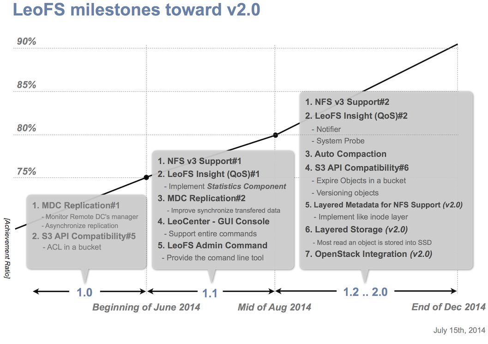

.. LeoFS documentation
.. Copyright (c) 2013-2014 Rakuten, Inc.

-----------------------
FAQ: LeoFS Fundamentals
-----------------------

What kind of storage is leofs?
^^^^^^^^^^^^^^^^^^^^^^^^^^^^^^

`LeoFS <http://leo-project.net/leofs/>`_ is a highly scalable, fault-tolerant `object storage <http://en.wikipedia.org/wiki/Object_storage>`_ for the Web. Significantly, LeoFS supports huge amount and various kind `unstructured data <http://en.wikipedia.org/wiki/Unstructured_data>`_ such as photo, movie, document, log data and so on.

Operationally, LeoFS features multi-master replication with automated failover and built-in horizontal scaling via `consistent-hashing <http://en.wikipedia.org/wiki/Consistent_hashing>`_.

See Also:
    * `LeoFS Overview <http://leo-project.net/leofs/docs/intro.html>`_
    * `Slide - Scaling and High Performance Storage System: LeoFS <http://www.slideshare.net/rakutentech/scaling-and-high-performance-storage-system-leofs>`_

What are typical uses for LeoFS?
^^^^^^^^^^^^^^^^^^^^^^^^^^^^^^^^

If you are searching a storage system that is able to store huge amount and various kind of files such as photo, movie, log data and so on, LeoFS is suitable for that.

This is because LeoFS is a highly available, distributed storage system. Also, LeoFS can be used to store a lot of data efficiently, safely, and inexpensively.

See Also:
    * `LeoFS Overview <http://leo-project.net/leofs/docs/intro.html#leofs-overview>`_

What is architecture of LeoFS?
^^^^^^^^^^^^^^^^^^^^^^^^^^^^^^

We've been mainly focusing on **High Availability**, **High Scalability** and **High Cost Performance Ratio** since unstructured data such as images, movies and logs have been exponentially increasing in our services day by day, and we needed to build a cloud storage that can handle all them.

LeoFS consists of 3 core components - `Gateway <leofs-gateway-detail.html>`_, `Storage <leofs-storage-detail.html>`_ and `Manager <leofs-manager-detail.html>`_. The role of each component is clearly defined.

.. image:: _static/images/leofs-architecture.png
   :width: 780px

`Gateway <leofs-gateway-detail.html>`_ handles http-requests and http-responses from clients when using REST-API OR S3-API. Also, it has the built-in object-cache system.

`Storage <leofs-storage-detail.html>`_ handles *GET*, *PUT* and *DELETE*, Also it has replicator and recoverer in order to keep running and consistency.

`Manager <leofs-manager-detail.html>`_ always monitors Gateway(s) and Storage(s). Manger monitors node-status and RING(logical routing-table) checksum to keep running and consistency.

Also, what we payed attention when we desined LeoFS are the following 3 things:
    * To keep always running and No `SPOF - Single Point Of Failure <http://en.wikipedia.org/wiki/Single_point_of_failure>`_
    * To keep high-performance, regardless of the kind and amount of data
    * To provide easy administration, we already provide LeoFS CUI and GUI console.

Is there the roadmap of LeoFS?
^^^^^^^^^^^^^^^^^^^^^^^^^^^^^^

We've published LeoFS milestones on both of `GitHub <https://github.com/leo-project/leofs#milestones>`_ and `LeoFS website <http://leo-project.net/leofs/docs/intro.html#milestones>`_. We may revise the milestones occasionally because there is a possibility to add new features or change priority of implementation. We'll keep them always updated.

.. raw:: html

       

What language is LeoFS written in?
^^^^^^^^^^^^^^^^^^^^^^^^^^^^^^^^^^

LeoFS is implemented in `Erlang/OTP <http://www.erlang.org/>`_. Also, `LeoCenter <http://leo-project.net/leofs/docs/leo_center.html>`_ as Web GUI Console is written in `Ruby <https://www.ruby-lang.org/en/>`_ and `JavaScript <http://en.wikipedia.org/wiki/JavaScript>`_.

See Also:
    * `LeoFS Overview <http://leo-project.net/leofs/docs/intro.html#leofs-overview>`_
    * `LeoFS on GitHub <https://github.com/leo-project/leofs>`_
    * `LeoCenter on Github <https://github.com/leo-project/leo_center>`_

