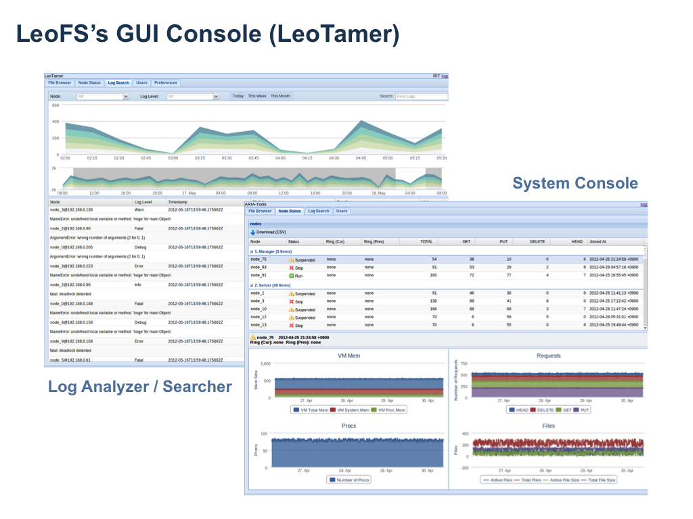

.. LeoFS documentation master file, created by
   sphinx-quickstart on Tue Feb 21 10:38:17 2012.
   You can adapt this file completely to your liking, but it should at least
   contain the root `toctree` directive.

Introduction
================================

LeoFS Overview
--------------------------------

**"LeoFS"** is highly scalable, fault-tolerant distributed file system (DFS) for the Web. Different than traditional distributed file system and other DFS — **"LeoFS"** offers a number of unique benefits to users:

* High Cost Performance
* High Reliability
* High Scalability

.. image:: _static/images/leofs-architecture.011.png
   :width: 760px

Goals
--------------------------------

* LeoFS aims to provide the following advantages:
    * HIGH Cost Performance
        * Fast - Over 200MB/sec into 10GE
        * A lower cost than other storage
        * Provide easy management and easy operation
    * HIGH Reliability
        * Nine nines - Operating ratio is 99.9999999%
    * High Scalability
        * Build "Huge Cluster" at low cost

Milestones
--------------------------------

* 0.12 (Oct 2012 - Jan 2013)
    * Large Object Support (incl.Streaming/Multi-part/Range requests)
    * Web GUI-Console (LeoTamer - Optional)
        * Cluster manager/monitor
        * Log Analysis/Search

* 0.14 (Feb 2013 - June)
    * Multi-layer Cache (Using SSD)
    * Objects Expiration into the bucket
    * Job Scheduler on the Manager
    * QoS System (LeoDenebola - Optional)

* Future Works (2013)
    * Multi-Datacenter for Geographical Optimization

