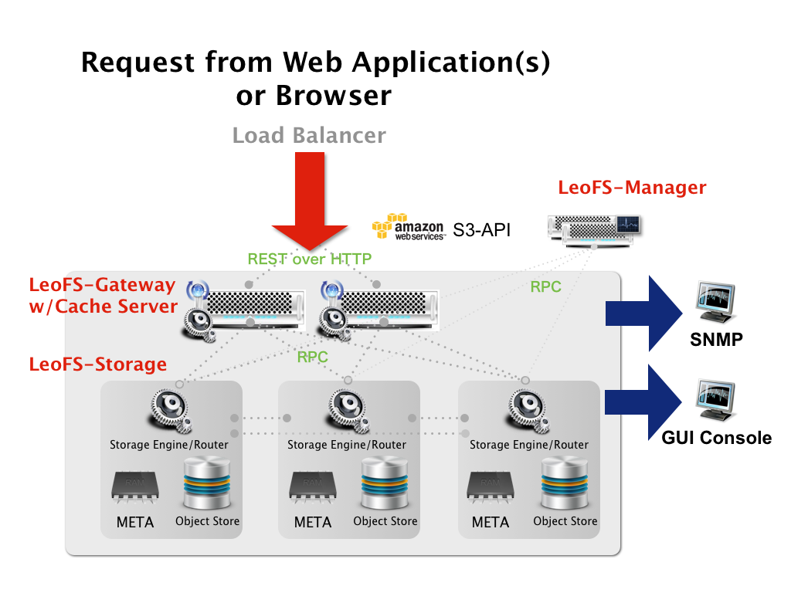

.. LeoFS documentation master file, created by
   sphinx-quickstart on Tue Feb 21 10:38:17 2012.
   You can adapt this file completely to your liking, but it should at least
   contain the root `toctree` directive.

Introduction
================================

LeoFS Overview
--------------------------------

**LeoFS** is a highly scalable, fault-tolerant distributed file system (DFS) for the Web. LeoFS is the leading DFS and offers a number of unique benefits to users:

* High Cost Performance Ratio
* High Reliability
* High Scalability

Goals
--------------------------------

* LeoFS aims to provide the following advantages:
    * HIGH Cost Performance Ratio
        * Fast - Over 200MB/sec in a 10GE network
        * A lower cost than other storage
        * Easy management and easy operation
    * HIGH Reliability
        * Nine nines - 99.9999999% availability
    * High Scalability
        * Build a huge cluster at low cost

Milestones
--------------------------------

* *DONE* - 0.12 (Oct 2012 - Jan 2013)
    * Large Object Support (incl.Streaming/Multi-part/Range requests)
    * Web GUI-Console (LeoTamer - Optional)
        * Cluster manager/monitor
        * Log Analysis/Search
* 0.14 (Feb 2013 - May)
    * Multi-layer Cache (Using SSD)
    * Job Scheduler on the Manager
    * API-related:
        * Increase compatibility S3-APIs#3
        * Support for OpenStack Swift-API
    * QoS System Phase-1 (LeoDenebola - Option)
    * Web-Console (Leo Tamer - Option)
        * Log Analysis/Search
* 1.0 (June 2013 - )
    * Multi-Datacenter Data Replication
    * OpenStack Integration
    * Increase compatibility S3-APIs#4
        * Objects Expiration into the bucket
        * Other bucket operations
    * QoS System Phase-2 (LeoDenebola - Option)
    * Web-Console (Leo Tamer - Option)
        * QoS Integration
        * Log Analysis/Search

