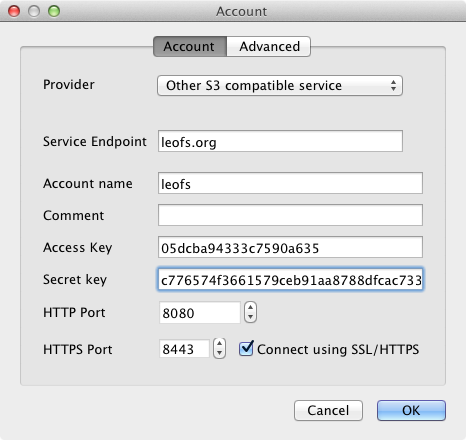
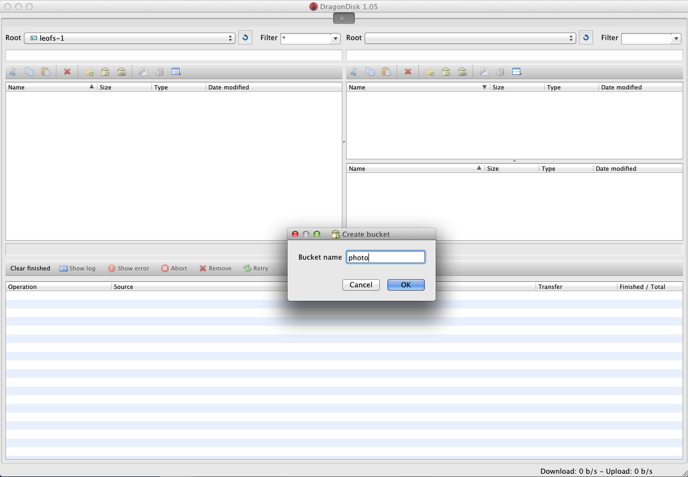

Amazon S3 Client Tutorials
================================

Getting Your S3 Key
---------------------

You can get S3-API's Keys from ``LeoFS's Manager Console``.

::

  $ telnet 127.0.0.1 10010
  Trying 127.0.0.1...
  Connected to 127.0.0.1.
  Escape character is '^]'.

's3-gen-key ${USER-ID}' command generates your s3 key.

::

  s3-gen-key ${USER-ID}
  access-key-id: 05dcba94333c7590a635
  secret-access-key: c776574f3661579ceb91aa8788dfcac733b21b3a

.. _aws-sdk-ruby-label:

Getting Started with Ruby: 'aws-sdk'
------------------------------------------------------

A part of the Ruby's library, ``aws-sdk``, is available against the LeoFS as a client. It's made by Amazon. The official document of ``aws-sdk`` is here: http://aws.amazon.com/sdkforruby/.

Install AWS-SDK for Ruby
^^^^^^^^^^^^^^^^^^^^^^^^^

::

  $ gem install aws-sdk

Sample Code
^^^^^^^^^^^^^^^^^^^^^^

Connect to LeoFS
"""""""""""""""""

.. note:: You need to rewrite 'Endpoint' and 'Port' as follows:

.. code-block:: ruby

  require "aws-sdk"

  Endpoint = "localhost"
  Port = 8080

  class LeoFSHandler < AWS::Core::Http::NetHttpHandler
    # magic to reconfigure port
    def handle(request, response)
      request.port = ::Port
      super
    end
  end

  AWS.config(
    access_key_id: "YOUR_ACCESS_KEY_ID", # set your s3 key
    secret_access_key: "YOUR_SECRET_ACCESS_KEY",
    s3_endpoint: Endpoint,
    http_handler: LeoFSHandler.new,
    s3_force_path_style: true,
    use_ssl: false
  )

  s3 = AWS::S3.new

PUT an object into the LeoFS
"""""""""""""""""""""""""""""

.. code-block:: ruby

  # create bucket
  s3.buckets.create("photo")

  # get bucket
  bucket = s3.buckets["photo"]

  # create a new object
  object = bucket.objects.create("image", "value")

  # show objects in the bucket
  bucket.objects.with_prefix("").each do |obj|
    p obj
  end

  # retrieve an object
  object = bucket.objects["image"]

  # insert an object
  object.write(
    file: "/path/to/image.png",
    content_type: "png/image"
  )

GET an object from the LeoFS
"""""""""""""""""""""""""""""

.. code-block:: ruby

  image = object.read

DELETE an object from the LeoFS
""""""""""""""""""""""""""""""""

.. code-block:: ruby

  object.delete

HEAD an object from the LeoFS
""""""""""""""""""""""""""""""""

.. code-block:: ruby

  metadata = object.head
  p metadata.to_hash

.. _aws-s3-ruby-label:

Getting Started with Ruby: 'aws-s3'
-------------------------------------

A part of the Ruby's library, ``aws-s3``, is available against the LeoFS as a client. The official document of ``aws-s3`` is here: http://amazon.rubyforge.org/.

Install AWS-S3
^^^^^^^^^^^^^^^^^^^^^^

..

   $ gem install aws-s3

Sample Code
^^^^^^^^^^^^^^^^^^^^^^

The following sample script should upload a text file (located in ``/path/to/localfile``) to LeoFS server at ``localhost:8080/somewhere/path/to/remotefile``.

.. code-block:: ruby

   require 'aws/s3'

   AWS::S3::Base.establish_connection!(
     :access_key_id     => "dummy",
     :secret_access_key => "dummy",
     :server            => "localhost",
     :port              => 8080)

   file = '/path/to/localfile'

   AWS::S3::S3Object.store('/path/to/remotefile',
                  open(file).read,
                  'somewhere',
                  :content_type => 'text/plain')

You can confirm the uploaded file by using ``curl`` command with ``'Host: s3.amazonaws.com'`` header.

.. code-block:: bash

   $ curl --header "Host: s3.amazonaws.com" http://localhost:8080/somewhere/path/to/remotefile

.. note:: ``aws-s3`` client force to use ``'s3.amazonaws.com'`` for the value of Host header. This matches the pattern #1 of :ref:`s3-path-label`

You can also fetch the uploaded file by ``S3Object.value(path, bucket)`` method as follows.

.. code-block:: ruby

   S3Object.value('/path/to/remotefile', 'somewhere')

As for deleting an object, you can use ``S3Object.delete(key, bucket)``

.. code-block:: ruby

   S3Object.value('/path/to/remotefile', 'somewhere')

.. note:: ``S3Object.find(path, backet)`` does not work because the current LeoFS does not support Bucket API on which the ``find`` method depends.

.. Getting Started with Python: 'boto'
.. -------------------------------------

.. Boto is a Python interface to Amazon Web Services. You can use it against LeoFS too.
.. Repository: https://github.com/boto/boto
.. Documentation: http://docs.pythonboto.org/en/latest/index.html

.. Install boto
.. ^^^^^^^^^^^^^^^^^^^^^^

.. setup.py
.. """"""""
.. ::

..   git clone https://github.com/boto/boto.git; cd boto; sudo python setup.py install

.. easy_install
.. """"""""""""
.. ::

..   sudo easy_install boto

.. Sample Code
.. """""""""""

.. .. code-block:: python

..   #!/usr/bin/python
..   # coding: utf8
  
..   from boto.s3.connection import S3Connection, OrdinaryCallingFormat
..   from boto.s3.bucket import Bucket
..   from boto.s3.key import Key
  
..   AWS_ACCESS_KEY = "YOUR_ACCESS_KEY_ID"
..   AWS_SECRET_ACCESS_KEY = "YOUR_SECRET_ACCESS_KEY"
  
..   conn = S3Connection(AWS_ACCESS_KEY,
..                       AWS_SECRET_ACCESS_KEY,
..                       host = "example.com",
..                       port = 8080,
..                       calling_format = OrdinaryCallingFormat(),
..                       is_secure = False
..          )
 
..   # create bucket
..   bucket = conn.create_bucket("leofs-bucket")

..   # create object
..   s3_object = bucket.new_key("image_file")

..   # write
..   s3_object.set_contents_from_string("This is a text.")
  
..   # show buckets
..   for bucket in conn.get_all_buckets():
..     print bucket
  
..     # show S3Objects
..     for obj in bucket.get_all_keys():
..       print obj 
  
..     print
  
..   # get bucket
..   bucket = conn.get_bucket("leofs-bucket")
..   print bucket
  
..   # get S3Object
..   s3_object = bucket.get_key("image_file")
..   print s3_object
  
..   # read
..   print s3_object.read()
  
..   # write from file
..   #s3_object.set_contents_from_filename("filename")
  
..   # delete S3Object
..   s3_object.delete()

.. .. _aws-sdk-php-label:

.. Getting Started with PHP: 'aws-sdk'
.. ------------------------------------------------------

.. Install aws-sdk for PHP
.. ^^^^^^^^^^^^^^^^^^^^^^^

.. php5-curl (Debian)
.. """"""""""""""""""

.. ::

..   sudo apt-get install php5-curl

.. PEAR (Debian)
.. """""""""""""

.. ::

..   sudo apt-get install php-pear

.. aws-sdk for PHP
.. ^^^^^^^^^^^^^^^^

.. ::

..   sudo pear channel-discover pear.amazonwebservices.com
..   sudo pear install aws/sdk

.. Sample Code
.. ^^^^^^^^^^^

.. .. code-block:: php

..   <?php
..   require_once 'AWSSDKforPHP/sdk.class.php';

..   const Host = "192.168.11.111";

..   $s3 = new AmazonS3(array(
..     "key" => "YOUR ACCESS KEY ID",
..     "secret" => "YOUR SECRET ACCESS KEY",
..   ));
  
..   $s3->enable_path_style();
  
..   $bucket_name = "bucket";
..   $object_name = "image_file";
  
..   # create object
..   $object = $s3->create_object($bucket_name, $object_name, array("body" => "This is a new object."));
  
..   # get object
..   $object = $s3->get_object($bucket_name, $object_name);
..   print_r($object);
  
..   # head
..   $head = $s3->get_object_headers($bucket_name, $object_name);
..   print_r($head);
  
..   # delete
..   $result = $s3->delete_object($bucket_name, $object_name);
..   print_r($result);
..   ?>

.. Getting Started with Node: 'knox'
.. -------------------------------------

.. _s3fs-c-label:

Getting Started with S3FS-C (Ubuntu-12.04 LTS)
------------------------------------------------------

S3FS-C is a FUSE (File System in User Space) based file system backed by Amazon S3 storage buckets. Once mounted, S3 can be used just like it was a local file system.

Install libs for S3FS-C into Ubuntu-12.04
^^^^^^^^^^^^^^^^^^^^^^^^^^^^^^^^^^^^^^^^^^

::

    sudo apt-get install libfuse-dev libcurl4-openssl-dev fuse-utils

Install "S3FS-C"
^^^^^^^^^^^^^^^^^^^^^^^^^

::

    git clone https://github.com/tongwang/s3fs-c.git
    cd s3fs-c
    ./configure
    make
    sudo make install

Modify "/ets/hosts"
^^^^^^^^^^^^^^^^^^^^^^^^^

* Add a LeoFS's domain in ``/ets/hosts``
* LeoFS's domains are governed by :ref:`this rule <s3-path-label>`

::

    $ sudo vi /ets/hosts

    ## Add a LeoFS's domain ##
    127.0.0.1 localhost ${BUCKET_NAME}.localhost

Create a credential file for S3FS
^^^^^^^^^^^^^^^^^^^^^^^^^^^^^^^^^^

::

    $ vi ~/.passwd-s3fs

    ## Set access-key and secret-key ##
    ${ACCESS_KEY}:${SECRET_KEY}

Mount "LeoFS"
^^^^^^^^^^^^^^^^^^^^^^^^^

::

    $ s3fs ${BUCKET_NAME} ${MOUNT_POINT} -o url='http://${END_POINT}:${PORT}'

.. _dragondisk-label:

Connect LeoFS from DragonDisk
------------------------------------------------------

DragonDisk is a powerful file manager for Amazon S3 Compatible Storage.

URL: http://www.dragondisk.com/

Setting up LeoFS account details
^^^^^^^^^^^^^^^^^^^^^^^^^^^^^^^^^^^^^^^^^^

* To setup your LeoFS's account, go to the menu ``File/Accounts``.
* If the details are valid, you can see that S3 has been added on the Root list.

Create a bucket
^^^^^^^^^^^^^^^^^^^^^^^^^^^^^^^^^^^^^^^^^^

* You need to create a bucket. Because each object is stored in a bucket.
* A bucket retrieved via a unique, developer-assigned key.

Operating files from  main view
^^^^^^^^^^^^^^^^^^^^^^^^^^^^^^^^^^^^^^^^^^

* You can ``upload files`` into the LeoFS, ``download file`` from the LeoFS and operate others.

.. image:: _static/images/dragondisk-1.png
   :width: 720px

.. _s3cmd-label:

Connect LeoFS from s3cmd
------------------------------------------------------

Download
^^^^^^^^^^

http://s3tools.org/s3cmd

Configure
^^^^^^^^^^^^

::

  $ ./s3cmd --configure

  Enter new values or accept defaults in brackets with Enter.
  Refer to user manual for detailed description of all options.
  
  Access key and Secret key are your identifiers for Amazon S3
  Access Key: ${ACCESS_KEY}
  Secret Key: ${SECRET_KEY}
  
  Encryption password is used to protect your files from reading
  by unauthorized persons while in transfer to S3
  Encryption password: 
  Path to GPG program [/usr/bin/gpg]: 
  
  When using secure HTTPS protocol all communication with Amazon S3
  servers is protected from 3rd party eavesdropping. This method is
  slower than plain HTTP and can't be used if you're behind a proxy
  Use HTTPS protocol [No]: 
  
  On some networks all internet access must go through a HTTP proxy.
  Try setting it here if you can't conect to S3 directly
  HTTP Proxy server name: localhost
  HTTP Proxy server port [3128]: 8080
  
  New settings:
    Access Key: 
    Secret Key: 
    Encryption password: 
    Path to GPG program: /usr/bin/gpg
    Use HTTPS protocol: False
    HTTP Proxy server name: localhost
    HTTP Proxy server port: 8080
  
  Test access with supplied credentials? [Y/n] 

Note: Set your LeoFS gateway host and port as HTTP Proxy server name and port.

Make a Bucket
^^^^^^^^^^^^^^^^

::

  $ ./s3cmd mb s3://bucket-name

PUT Object
^^^^^^^^^^^

::

  $ ./s3cmd put hoge.txt s3://bucket-name

GET Object
^^^^^^^^^^^^

::

  $ ./s3cmd get s3://bucket-name/hoge.txt ~/path/to/file

DELETE Object
^^^^^^^^^^^^^^

::

  $ ./s3cnd del s3://bucket-name/hoge.txt

Which command of s3cmd does LeoFS support?
^^^^^^^^^^^^^^^^^^^^^^^^^^^^^^^^^^^^^^^^^^^^

 +----+----------------------------+--------------------------------------+
 | #  | Command                    | Status                               |
 +====+============================+======================================+
 | 1  | **put**                    | **Yes**                              |
 +----+----------------------------+--------------------------------------+
 | 2  | **get**                    | **Yes**                              |
 +----+----------------------------+--------------------------------------+
 | 3  | **del**                    | **Yes**                              |
 +----+----------------------------+--------------------------------------+
 | 4  | **mb**                     | **Yes**                              |
 +----+----------------------------+--------------------------------------+
 | 5  | ls                         | No                                   |
 +----+----------------------------+--------------------------------------+
 | 6  | db                         | No                                   |
 +----+----------------------------+--------------------------------------+
