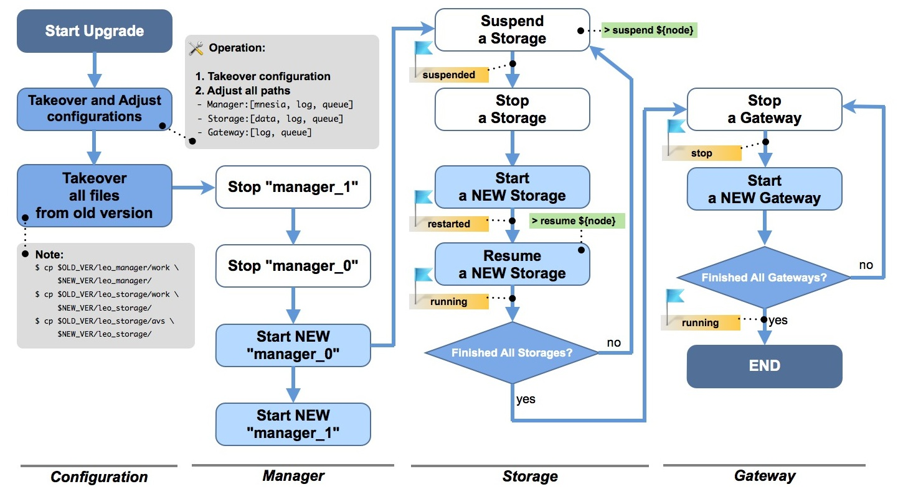
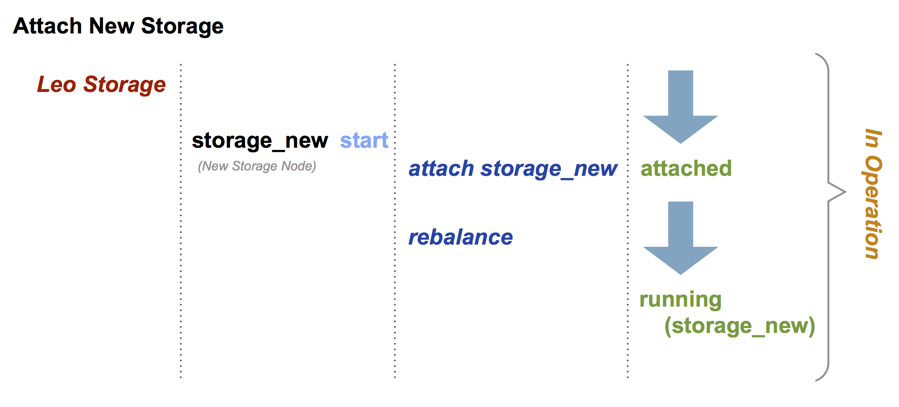
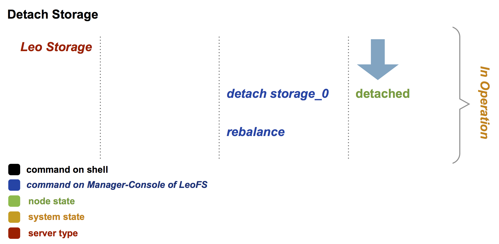

.. =========================================================
.. LeoFS documentation
.. Copyright (c) 2012-2014 Rakuten, Inc.
.. http://leo-project.net/
.. =========================================================

.. index::
    System maintenance

System Maintenance
==================

.. index::
    pair: System maintenance; Upgrade old version to 1.1.5

\

Upgrade your old version LeoFS to v1.1.5
----------------------------------------

This section describes the way of replacement of old LeoFS to v1.1.5

Upgrade flow diagram
^^^^^^^^^^^^^^^^^^^^

\

* `The diagram only <http://www.leofs.org/docs/_images/leofs-upgrade-flow-diagram.jpg>`_

\

.. note:: If you're using LeoFS v1.0.0-pre1, v0.16 or v0.14, you need to take over the configuration of ``metadata-storage`` as follows because the default configuration is ``leveldb`` from v1.0.0-pre2. We're planning to provide the ``db-converter`` tool - from ``bitcask`` to ``leveldb`` with v1.2.0.

Takeover a part of confugurations
^^^^^^^^^^^^^^^^^^^^^^^^^^^^^^^^^^^

\

+-------------------------------------+---------------+
| Item                                | Default value |
+=====================================+===============+
| leo_object_storage.metadata_storage | bitcask       |
+-------------------------------------+---------------+

\

Adjust Every Path
^^^^^^^^^^^^^^^^^

* LeoFS Manager: [mnesia, log-dir and queue-dir]

.. code-block:: bash

    .
    .
    .
    ## Mnesia dir
    mnesia.dir = ./work/mnesia/{IP}
    .
    .
    .
    ## Log level: [0:debug, 1:info, 2:warn, 3:error]
    log.log_level = 1
    ## Output log file(s) - Erlang's log
    log.erlang = ./log/erlang
    ## Output log file(s) - app
    log.app = ./log/app
    ## Output log file(s) - members of storage-cluster
    log.member_dir = ./log/ring
    ## Output log file(s) - ring
    log.ring_dir = ./log/ring

    ## Directory of queue for monitoring "RING"
    queue_dir = ./work/queue
    ## Directory of SNMP agent configuration
    snmp_agent = ./snmp/snmpa_manager_0/LEO-MANAGER

* LeoFS Storage: [obj_containers, log-dir and queue-dir]

.. code-block:: bash

    ## Object container
    obj_containers.path = [./avs]
    obj_containers.num_of_containers = [8]

    ## e.g. Case of plural pathes
    ## obj_containers.path = [/var/leofs/avs/1, /var/leofs/avs/2]
    ## obj_containers.num_of_containers = [32, 64]
    .
    .
    .
    ## Log level: [0:debug, 1:info, 2:warn, 3:error]
    log.log_level = 1
    ## Output log file(s) - Erlang's log
    log.erlang = ./log/erlang
    ## Output log file(s) - app
    log.app = ./log/app
    ## Output log file(s) - members of storage-cluster
    log.member_dir = ./log/ring
    ## Output log file(s) - ring
    log.ring_dir = ./log/ring

    ## Directory of queue for monitoring "RING"
    queue_dir = ./work/queue
    ## Directory of SNMP agent configuration
    snmp_agent = ./snmp/snmpa_storage_0/LEO-STORAGE

* LeoFS Gateway: [SSL-related files, cache-related pathes, log-dir and queue-dir]

.. code-block:: bash

    ## SSL Certificate file
    http.ssl_certfile = ./etc/server_cert.pem
    ## SSL key
    http.ssl_keyfile  = ./etc/server_key.pem

    ## Directory for the disk cache data
    cache.cache_disc_dir_data    = ./cache/data
    ## Directory for the disk cache journal
    cache.cache_disc_dir_journal = ./cache/journal
    .
    .
    .
    ## Log level: [0:debug, 1:info, 2:warn, 3:error]
    log.log_level = 1
    ## Output log file(s) - Erlang's log
    log.erlang = ./log/erlang
    ## Output log file(s) - app
    log.app = ./log/app
    ## Output log file(s) - members of storage-cluster
    log.member_dir = ./log/ring
    ## Output log file(s) - ring
    log.ring_dir = ./log/ring

    ## Directory of queue for monitoring "RING"
    queue_dir = ./work/queue
    ## Directory of SNMP agent configuration
    snmp_agent = ./snmp/snmpa_gateway_0/LEO-GATEWAY

.. index::
    pair: System maintenance; Attach/Detach node operation

Attach/Detach node into a Storage-cluster in operation
------------------------------------------------------

This section describes the process of adding and removing nodes in a LeoFS Storage cluster.

* Adding a storage node:
    * The node can be added to the cluster once it is running. You can use the :ref:`rebalance <rebalance-command>` command to request a join from the Manager.
* Removing a storage node:
    * The node can be removed from the cluster when it is either running or stopped. You can use the :ref:`detach <detach-command>` command to remove the node.
    * After that, you need to execute the :ref:`rebalance <rebalance-command>` command in the Manager to actually remove the node from the storage cluster.

.. index::
   detach-storage

\

.. index::
    pair: System maintenance; LeoFS Gateway access-log format

LeoFS Gateway Access-log Format
---------------------------------------------------

Since
^^^^^^

LeoFS v1.0.0-pre3

Overview
^^^^^^^^

LeoFS-Gateway is able to output access-log. If you would like to use this option, you can check and set :ref:`LeoFS Gateway configuration <conf_gateway_label>`.

Sample
^^^^^^

::

    --------+-------+--------------------+----------+-------+---------------------------------------+-----------------------+----------
    Method  | Bucket| Path               |Child Num |  Size | Timestamp                             | Unixtime              | Response
    --------+-------+--------------------+----------|-------+---------------------------------------+-----------------------+----------
    [HEAD]   photo   photo/1              0          0       2013-10-18 13:28:56.148269 +0900        1381206536148320        500
    [HEAD]   photo   photo/1              0          0       2013-10-18 13:28:56.465670 +0900        1381206536465735        404
    [HEAD]   photo   photo/city/tokyo.png 0          0       2013-10-18 13:28:56.489234 +0900        1381206536489289        200
    [GET]    photo   photo/1              0          1024    2013-10-18 13:28:56.518631 +0900        1381206536518693        500
    [GET]    photo   photo/city/paris.png 0          2048    2013-10-18 13:28:56.550376 +0900        1381206536550444        404
    [PUT]    logs    logs/leofs           1          5242880 2013-10-18 13:28:56.518631 +0900        1381206536518693        500
    [PUT]    logs    logs/leofs           2          5242880 2013-10-18 13:28:56.518631 +0900        1381206536518693        500
    [PUT]    logs    logs/leofs           3          5120    2013-10-18 13:28:56.518631 +0900        1381206536518693        500

Format
^^^^^^

.. note:: The format of the access log is **Tab Separated Values**.

+---------------+------------------------------------------------------------+
| Column Number | Description                                                |
+===============+============================================================+
| 1             | Method: [HEAD|PUT|GET|DELETE]                              |
+---------------+------------------------------------------------------------+
| 2             | Bucket                                                     |
+---------------+------------------------------------------------------------+
| 3             | Filename (including path)                                  |
+---------------+------------------------------------------------------------+
| 4             | Child number of a file                                     |
+---------------+------------------------------------------------------------+
| 5             | File Size (byte)                                           |
+---------------+------------------------------------------------------------+
| 6             | Timestamp with timezone                                    |
+---------------+------------------------------------------------------------+
| 7             | Unixtime (including micro-second)                          |
+---------------+------------------------------------------------------------+
| 8             | Response (HTTP Status Code)                                |
+---------------+------------------------------------------------------------+

\

.. _data_diagnosis_log:

.. index::
    pair: System maintenance; LeoFS Storage data-diagnosis-log format

LeoFS Storage Data Diagnosis log Format
-------------------------------------------------------

Since
^^^^^

LeoFS v1.1.5

Overview
^^^^^^^^

LeoFS-Storage is able to diagnose the data. If you would like to use this option, you can check and set :ref:`LeoFS Storage configuration <conf_storage_label>`.

* See also: :ref:`diagnose-start command <diagnose-start>`

Sample - List of files
^^^^^^^^^^^^^^^^^^^^^^

::

    ------+------------------------------------------+------------------------------------------------------------+-----------+------------+------------------+--------------------------+----
    Offset| RING's address-id                        | Filename                                                   | Child num | File Size  | Unixtime         | Localtime                |del?
    ------+------------------------------------------+------------------------------------------------------------+-----------+------------+------------------+--------------------------+----
    194     296754181484029444656944009564610621293   photo/leo_redundant_manager/Makefile                             0       2034        1413348050768344   2014-10-15 13:40:50 +0900   0
    2400    185993533055981727582172380494809056426   photo/leo_redundant_manager/ebin/leo_redundant_manager.beam      0       24396       1413348050869454   2014-10-15 13:40:50 +0900   0
    38446   53208912738248114804281793572563205919    photo/leo_rpc/.git/refs/remotes/origin/HEAD                      0       33          1413348057441546   2014-10-15 13:40:57 +0900   0
    38658   57520977797167422772945547576980778561    photo/leo_rpc/ebin/leo_rpc_client_utils.beam                     0       2576        1413348057512261   2014-10-15 13:40:57 +0900   0
    69506   187294034498591995039607573685274229706   photo/leo_backend_db/src/leo_backend_db_server.erl               0       13911       1413348068031188   2014-10-15 13:41:08 +0900   0
    83603   316467020376888598364250682951088839795   photo/leo_backend_db/test/leo_backend_db_api_prop.erl            0       3507        1413348068052219   2014-10-15 13:41:08 +0900   1

\

Format - List of files
^^^^^^^^^^^^^^^^^^^^^^

.. note:: The format of the data diagnosis log is **Tab Separated Values**.

+---------------+------------------------------------------------------------+
| Column Number | Description                                                |
+===============+============================================================+
| 1             | Offset of the AVS-file                                     |
+---------------+------------------------------------------------------------+
| 2             | RING's address id (routing-table)                          |
+---------------+------------------------------------------------------------+
| 3             | Filename                                                   |
+---------------+------------------------------------------------------------+
| 4             | Child number of a file                                     |
+---------------+------------------------------------------------------------+
| 5             | File Size (byte)                                           |
+---------------+------------------------------------------------------------+
| 6             | Timestamp - unixtime                                       |
+---------------+------------------------------------------------------------+
| 7             | Timestamp - localtime                                      |
+---------------+------------------------------------------------------------+
| 8             | Removed file?                                              |
+---------------+------------------------------------------------------------+

\

Sample - Report of a data diagnosis / data compaction
^^^^^^^^^^^^^^^^^^^^^^^^^^^^^^^^^^^^^^^^^^^^^^^^^^^^^

.. code-block:: erlang

    {file_path,"/home/yosuke/dev/leo/test/leofs-1.1.5/package/leo_storage/avs/object/0.avs"}.
    {avs_ver,<<"LeoFS AVS-2.4">>}.
    {num_of_active_objs,9}.
    {size_of_active_objs,52518}.
    {total_num_of_objs,9}.
    {total_size_of_objs,52518}.
    {start_datetime,"2014-10-15 14:21:31 +0900"}.
    {end_datetime,"2014-10-15 14:21:31 +0900"}.
    {errors,[]}.
    {duration,0}.
    {result,success}.

Format - Report of a data diagnosis / data compaction
^^^^^^^^^^^^^^^^^^^^^^^^^^^^^^^^^^^^^^^^^^^^^^^^^^^^^

.. note:: The format of the data diagnosis/compaction report is **Erlang Term**.

+--------------------+------------------------------------------------------------+
| Element            | Description                                                |
+====================+============================================================+
| file_path          | AVS-file path                                              |
+--------------------+------------------------------------------------------------+
| avs_ver            | AVS-file version                                           |
+--------------------+------------------------------------------------------------+
| num_of_active_obj  | Number of active objects                                   |
+--------------------+------------------------------------------------------------+
| size_of_active_obj | Summary of size of active objects                          |
+--------------------+------------------------------------------------------------+
| total_num_of_objs  | Total number of objects                                    |
+--------------------+------------------------------------------------------------+
| total_size_of_objs | Total size of objects                                      |
+--------------------+------------------------------------------------------------+
| start_datetime     | Data diagnosis/compaciton start datetime                   |
+--------------------+------------------------------------------------------------+
| end_datetime       | Data diagnosis/compaciton end datetime                     |
+--------------------+------------------------------------------------------------+
| duration           | Data diagnosis/compaciton duration time(second)            |
+--------------------+------------------------------------------------------------+
| errors             | Errors                                                     |
+--------------------+------------------------------------------------------------+
| result             | Result of data diagnosis/compaciton: [success|failure]     |
+--------------------+------------------------------------------------------------+

Diagnosis Log Dir
^^^^^^^^^^^^^^^^^

.. note:: The data diagnosis log is assigned at **LeoFS Storage's data directory** - :ref:`LeoFS Storage configuration <conf_storage_label>`.

::

    leo_storage_0/avs/log/
    |-- [ 102 Oct 15 14:00]  leo_object_storage_0 -> /home/leofs/dev/leofs-1.1.5/package/leo_storage_0/avs/log/leo_object_storage_0.20141015.14.2
    |-- [1.3K Oct 15 13:53]  leo_object_storage_0.20141015.13.1
    |-- [1.3K Oct 15 13:56]  leo_object_storage_0.20141015.13.2
    |-- [1.3K Oct 15 13:58]  leo_object_storage_0.20141015.13.3
    |-- [1.3K Oct 15 14:00]  leo_object_storage_0.20141015.13.4
    |-- [1.3K Oct 15 14:00]  leo_object_storage_0.20141015.14.1
    |-- [   0 Oct 15 14:00]  leo_object_storage_0.20141015.14.2
    |-- [ 376 Oct 15 13:45]  leo_object_storage_0.report.63580567518
    |-- [ 374 Oct 15 13:50]  leo_object_storage_0.report.63580567830
    |-- [ 362 Oct 15 13:53]  leo_object_storage_0.report.63580568032
    |-- [ 362 Oct 15 13:56]  leo_object_storage_0.report.63580568197
    |-- [ 362 Oct 15 13:58]  leo_object_storage_0.report.63580568300
    |-- [ 362 Oct 15 14:00]  leo_object_storage_0.report.63580568416
    |-- [ 362 Oct 15 14:00]  leo_object_storage_0.report.63580568445
    .
    .
    .

Diagnosis Log Files
^^^^^^^^^^^^^^^^^^^

+--------------------------------------------------+-----------------------------+
| Log File                                         | Description                 |
+==================================================+=============================+
| leo_object_storage_<avs-num>.<date>.<hour>.<seq> | List of files               |
+--------------------------------------------------+-----------------------------+
| leo_object_storage_<avs-num>.report.<timestamp>  | Report of a data diagnosis  |
+--------------------------------------------------+-----------------------------+

