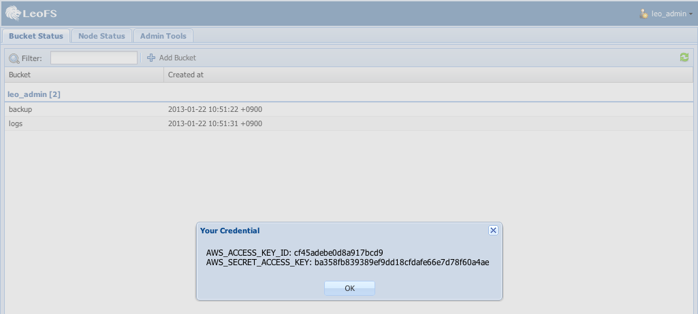
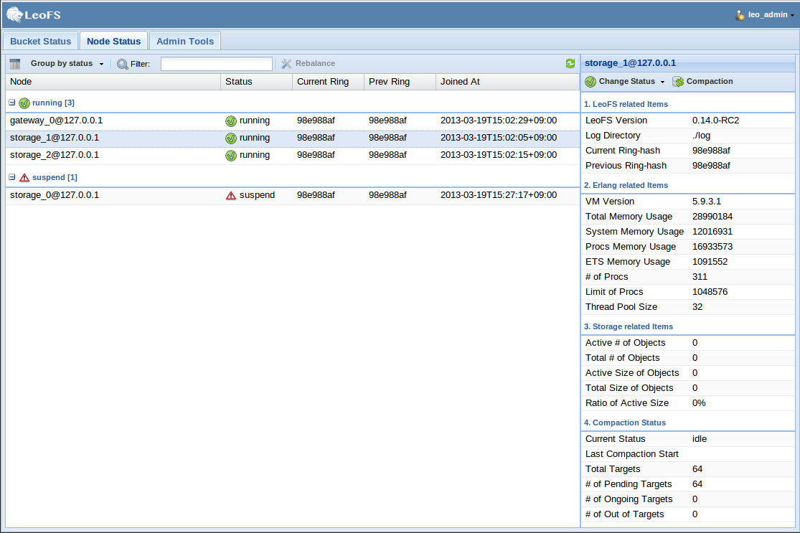
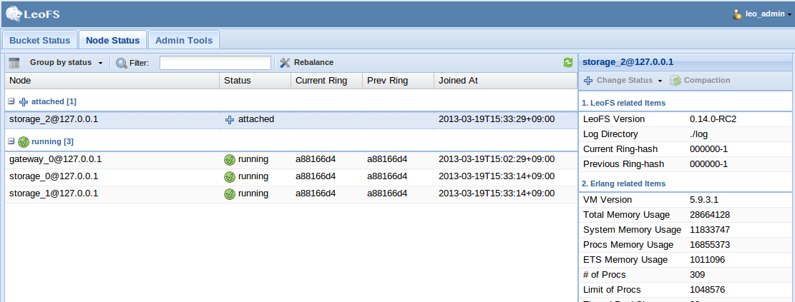
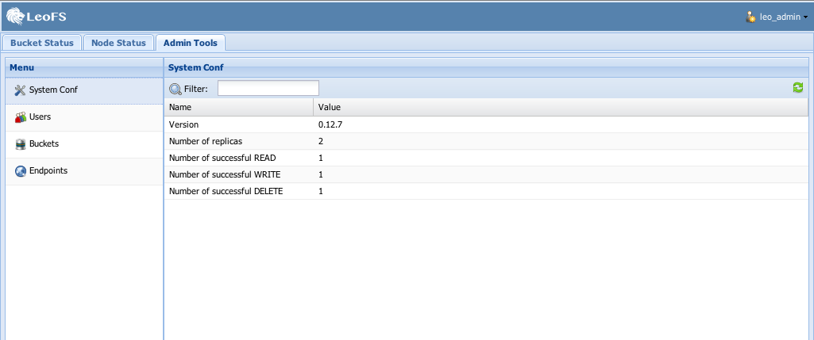

.. =========================================================
.. LeoFS documentation
.. Copyright (c) 2012-2014 Rakuten, Inc.
.. http://leo-project.net/
.. =========================================================

.. index::
   LeoCenter

LeoCenter v0.4.7
================

**LeoCenter** is LeoFS' Web console in your browser. You can use it to easily operate LeoFS.

Installation and configuration
------------------------------

Requirements
^^^^^^^^^^^^

* **LeoFS v0.16.8** or higher

Install LeoCenter
^^^^^^^^^^^^^^^^^

* **LeoCenter's Repository**: https://github.com/leo-project/leo_center
* **Ruby 2.0** OR higher
    * Download URL: http://www.ruby-lang.org/en/downloads/

::

  gem install bundler
  git clone https://github.com/leo-project/leo_center.git
  cd leo_center
  bundle install

Create Admin User
^^^^^^^^^^^^^^^^^

.. note:: You need to create an ``administrator`` user from LeoFS-Manager's console.

.. code-block:: bash

  $ leofs-adm create-user leo_admin password
  access-key-id: ab96d56258e0e9d3621a
  secret-access-key: 5c3d9c188d3e4c4372e414dbd325da86ecaa8068

  $ leofs-adm update-user-role leo_admin 9
  OK

Configure
^^^^^^^^^

.. note:: You need to modify ``config.yml`` to allow LeoCenter to connect to LeoFS-Manager.

::

  :managers:
    - "localhost:10020" # leofs manager - master node's host/port
    - "localhost:10021" # leofs manager - slave node's host/port
  :credential:
    :access_key_id: ${YOUR_ACCESS_KEY_ID}
    :secret_access_key: ${YOUR_SECRET_ACCESS_KEY}
  :session:
    :local:
      :secret: ""
      :expire_after: 300
  :snmp: # list of data in Node Status SNMP Chart
    - ETS memory usage (1-min Averages)
    - Processes memory usage (1-min Averages)
    - System memory usage (1-min Averages)

Starting LeoCenter
------------------

Using Thin Web Server
^^^^^^^^^^^^^^^^^^^^^

* Launch LeoCenter

.. code-block:: bash

  $ thin start -a ${HOST} -p ${PORT}

* Launch LeoCenter with SSL

.. code-block:: bash

  ## Caution: You need to prepare key and certification first
  $ thin start --ssl --ssl-key-file "${path/to/key}/leofs.key" \
               --ssl-cert-file "${path/to/cert}/leofs.crt" \
               --ssl-verify \
               -a ${HOST}

.. note:: | You are able to add setting in detail by these steps:
          |   1. Rename thin.yml.sample to thin.yml
          |   2. Edit thin.yml with check explanation of using "thin - -help"
          |   3. Launch LeoCenter by "thin start -C thin.yml"

Features
--------

Your Credentials
^^^^^^^^^^^^^^^^

* You can confirm your credentials by using the ``Security Credentials`` menu on the top right of the screen.

.. image:: ../../_static/screenshots/leofs_console/userinfo_0.png
   :width: 720px

\

Bucket Status View
^^^^^^^^^^^^^^^^^^

* You can get an overview of the buckets that belong to you.
    * You can create new buckets.
    * ``Deletion of a bucket`` is planned to be supported from ``LeoCenter v0.4.2``.

.. image:: ../../_static/screenshots/leofs_console/bucket_status_0.png
   :width: 720px

Node Status View
^^^^^^^^^^^^^^^^

* You can get an overview of the nodes in the cluster, and group them by ``type`` or ``status``.
* Group by type View:

\

.. image:: ../../_static/screenshots/leofs_console/nodestatus_0.png
   :width: 720px

* Group by status View:

\

* Administrators can use the ``Change Status button`` to suspend, resume or detach storage nodes.

\

.. image:: ../../_static/screenshots/leofs_console/nodestatus_3.png
   :width: 720px

\

Table - Changeable Status
"""""""""""""""""""""""""

\

+-----------------------+----------------------------+
|Current status         | Action available           |
+=======================+============================+
| |running| running     | suspend, detach            |
+-----------------------+----------------------------+
| |suspend| suspend     | resume                     |
+-----------------------+----------------------------+
| |restarted| restarted | resume                     |
+-----------------------+----------------------------+
| |stop| stop           | detach                     |
+-----------------------+----------------------------+

.. |running| image:: ../../_static/images/leofs-console-icons/available.png
.. |suspend| image:: ../../_static/images/leofs-console-icons/warn.png
.. |restarted| image:: ../../_static/images/leofs-console-icons/add.png
.. |stop| image:: ../../_static/images/leofs-console-icons/fire.png

\

Re balancing the storage cluster
""""""""""""""""""""""""""""""""

.. note:: The ``Rebalance button`` only becomes active when the storage status is ``attached`` or ``detached``.

\

Administration Tools
^^^^^^^^^^^^^^^^^^^^

System Conf View
""""""""""""""""

* Overview of the configuration of LeoFS
* Please see :ref:`LeoFS’ system-configuration <system-configuration-label>`

Users View
""""""""""

* Lists the registered users
    * You can create and delete users
    * You can change an user's role using the ``Update Role button``

.. image:: ../../_static/screenshots/leofs_console/admintools_users.png
   :width: 720px

Buckets View
""""""""""""

* Lists the registered buckets, per owner
    * You can create new buckets

.. image:: ../../_static/screenshots/leofs_console/admintools_buckets.png
   :width: 720px

Endpoints View
""""""""""""""

* List of registered endpoints
    * You can create and delete endpoints

.. image:: ../../_static/screenshots/leofs_console/admintools_endpoints.png
   :width: 720px

Milestones
----------

* 0.2 (Dec 2012 - Feb 2013) - *DONE*
    * Administration tools
        * User management
        * Bucket management
        * Endpoint management
    * Node Status
        * Status/Operation
    * Bucket status
        * Belonging bucket-list

* 0.4 (Mar - Aug 2014)
    *  User Group
        * Sharing LeoFS' credential-keys in the group
        * User management in the group

* 0.6 (Sept 2014 - )
    * Link LeoQoS *(LeoFS's Quality of Service)*
        * Bucket status
            * total of files
            * total used disk capacity

* 0.8
    * Log Search/Analysis (Option)

