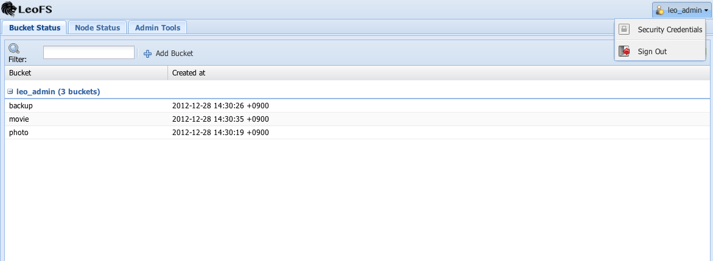
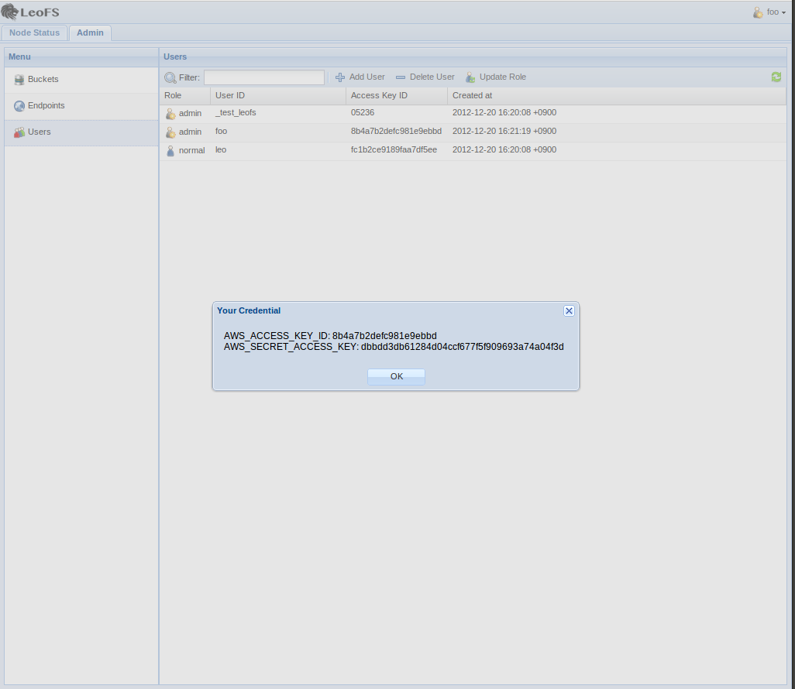
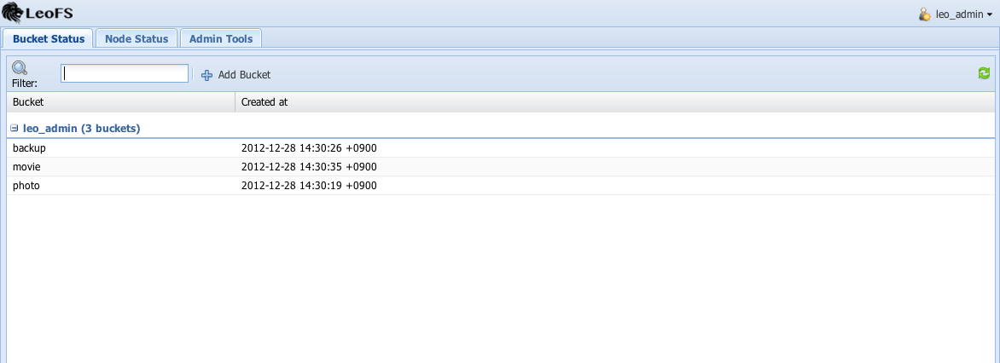
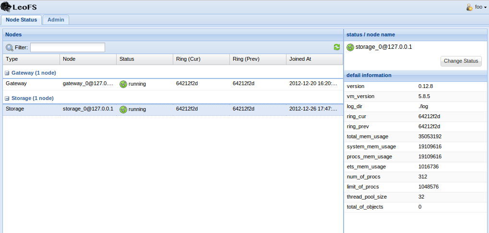
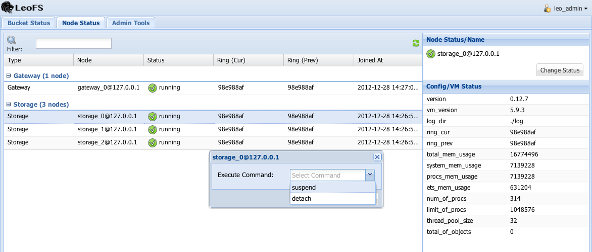
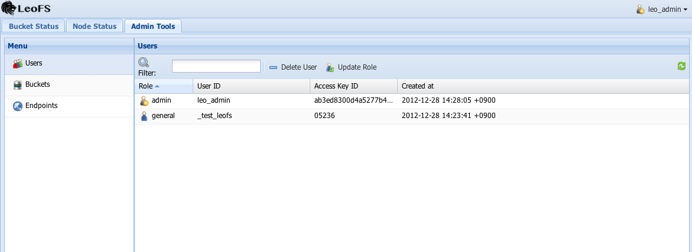
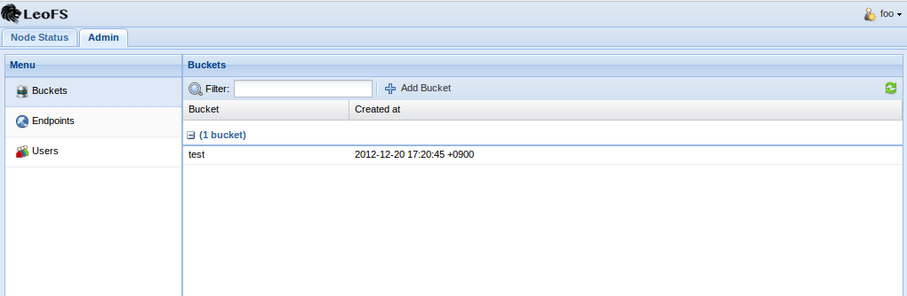
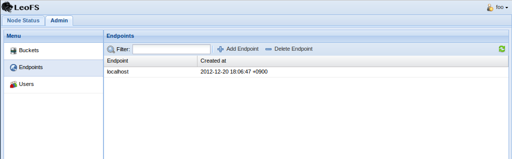

LeoTamer v0.2.6
===============

**LeoTamer** is LeoFS's GUI console on your browser. You can easily operate LeoFS.

Install
---------

Install LeoTamer
^^^^^^^^^^^^^^^^

* **LeoTamer's Repository**: https://github.com/leo-project/leo_tamer
* **Ruby 1.9.3-p362** or higher is required.
    * Download URL: http://ftp.ruby-lang.org/pub/ruby/1.9/ruby-1.9.3-p362.tar.gz

::

  gem install bundler
  git clone https://github.com/leo-project/leo_tamer.git
  cd leo_tamer
  bundle install

Create Admin User
^^^^^^^^^^^^^^^^^

* You need to create a user as ``administrator`` on LeoFS-Manager's console.

::

  $ telnet ${LEOFS_MANAGER_HOST} ${LEOFS_MANAGER_PORT}
  create-user new_admin password
    access-key-id: ab96d56258e0e9d3621a
    secret-access-key: 5c3d9c188d3e4c4372e414dbd325da86ecaa8068

  update-user-role new_admin 9 # set user role as admin
  OK

Configuration
^^^^^^^^^^^^^

Update ``config.yml`` for connecting LeoFS-Manager

::

  :managers:
    - "localhost:10020" # leofs manager - master node's host/port
    - "localhost:10021" # leofs manager - slave node's host/port
  :credential:
    :access_key_id: ${YOUR_ACCESS_KEY_ID}
    :secret_access_key: ${YOUR_SECRET_ACCESS_KEY}

Start LeoTamer
^^^^^^^^^^^^^^

::

  ruby config_webrick.ru ${LEO-TAMER-PORT}

Features
---------

Your Credentials
^^^^^^^^^^^^^^^^

* You can confirm your credentials with ``Security Credentials`` on the form of top right

\

Bucket Status View
^^^^^^^^^^^^^^^^^^

* You can confirm your belonging buckets
    * Able to create a bucket
    * ``Deletion of a bucket`` plan to support with ``LeoTamer v0.2.7``

Node Status View
^^^^^^^^^^^^^^^^

* You can confirm each node-status

* Administrators can change ``storage-staus`` with ``Change Status button``
    * storage-status: [resume, suspend, detach]

\

\

Table - Changeable Status
"""""""""""""""""""""""""

\

+-----------------+--------------------------+
|Current Status   |Changeable Status         |
+=================+==========================+
| running         | suspend, detach          |
+-----------------+--------------------------+
| suspend         | resume                   |
+-----------------+--------------------------+
| restarted       | resume                   |
+-----------------+--------------------------+
| stop            | detach                   |
+-----------------+--------------------------+

\

Administration-related views
^^^^^^^^^^^^^^^^^^^^^^^^^^^^

Users
"""""""""

* You can confirm the registered list of users
    * Able to create a user and delete it
    * Able to change a user role with ``Update Role button``

Buckets
"""""""""

.. note:: A bucket as root directory belongs to a user

* You can confirm the registered list of buckets
    * Able to create a bucket

Endpoints
""""""""""

* You can confirm the registered list of endpoints
    * Able to create an endpoint and delete it

Milestones
----------

* 0.2.x (Dec 2012 - Jan 2013)
    * Administration tools
        * User management
        * Bucket management
        * Endpoint management
    * Node Status
        * Status/Operation
    * Bucket status
        * Belonging bucket-list

* 0.4.x (Jan 2013)
    *  User Group
        * Sharing LeoFS's credential-keys in the group
        * User management in the group

* 0.6.x (Feb 2013)
    * Log Search/Analysis (Option)

* 0.8.x (Mar 2013)
    * Link QoS (Quality of Service - LeoDenebola)
        * Bucket status
            * total of files
            * total used disk capacity

