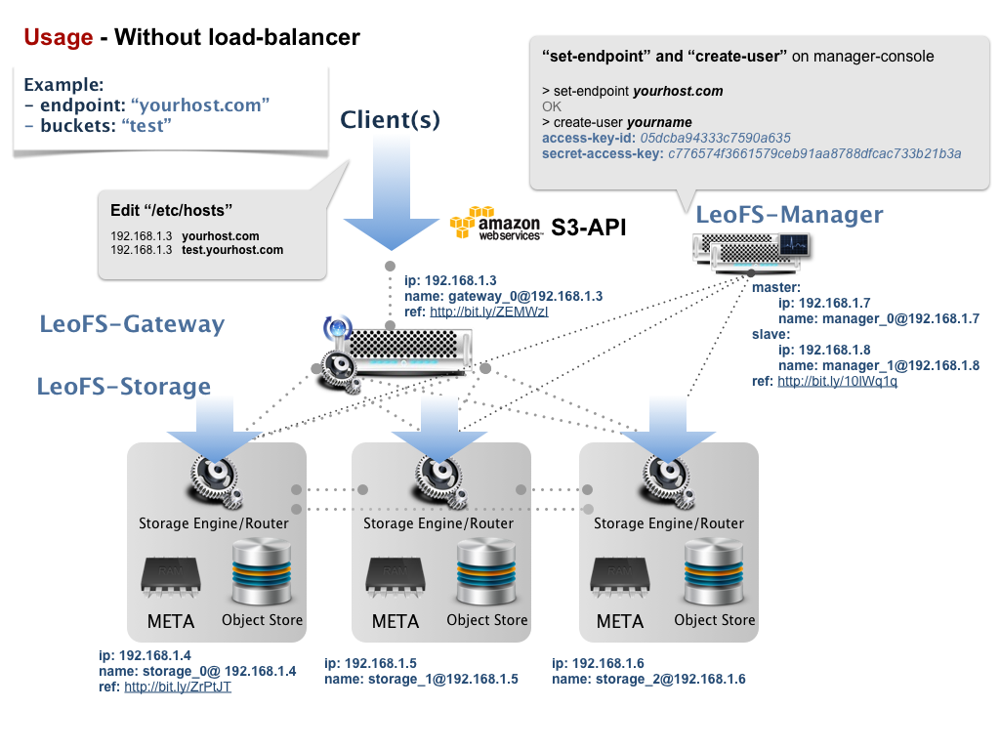

.. =========================================================
.. LeoFS documentation
.. Copyright (c) 2012-2014 Rakuten, Inc.
.. http://leo-project.net/
.. =========================================================

Usage
========

.. index::
   pair: Configuration; LeoFS Use Case - Without load-balancer

Testing without a load balancer
-------------------------------

* Example:
    * Endpoint: ``yourhost.com``
    * bucket: ``test``
* Client(s)
    * You need to edit ``/etc/hosts`` in your client machine(s)
    * You can use any S3 client, like
        * :ref:`Program Lang's clients <aws-sdk-ruby-label>`
        * :ref:`s3fs-c <s3fs-c-label>`
        * :ref:`s3cmd <s3cmd-label>`
        * :ref:`DragonDisk <dragondisk-label>`
* Servers configuration (only `ip` and `name`)
    * :ref:`Manager <conf_manager_label>`
        * IP: 192.168.1.7, 192.168.1.8
        * Name: manager_0@192.168.1.7, manager_1@192.168.1.8
    * :ref:`Gateway <conf_gateway_label>`
        * IP: 192.168.1.3
        * Name: gateway_0@192.168.1.3
    * :ref:`Storage <conf_storage_label>`
        * IP: 192.168.1.4 .. 192.168.1.6
        * Name: storage_0@192.168.1.4 .. storage_2@192.168.1.6
* Commands to execute with |leofs-adm|
    * Set an endpoint
    * Create a user

::

    $ leofs-adm add-endpoint <your-host-name>
    OK
    $ leofs-adm create-user <your-name>
    access-key-id: 05dcba94333c7590a635
    secret-access-key: c776574f3661579ceb91aa8788dfcac733b21b3a

\

Production/Staging with a load balancer
---------------------------------------

(under construction)

.. |leofs-adm| raw:: html

   <a href="https://github.com/leo-project/leofs/blob/master/leofs-adm" target="_blank">leofs-adm</a>
